# GoWordLadder

GoLang [Word Ladder](https://en.wikipedia.org/wiki/Word_ladder) solver, generator & analysis.

## Running

(requires Go 1.26 installed)

CLI interactively:
```
go run ./cmd/cli
```

TUI (terminal UI):
```
go run ./cmd/tui
```

Both will use default dictionary - to use an alternate dictionary:

```
export GOWL_DICTIONARY=enwiktionary
```

#### TUI Screenshots

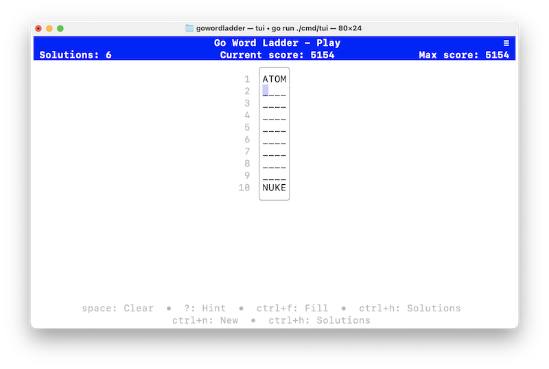
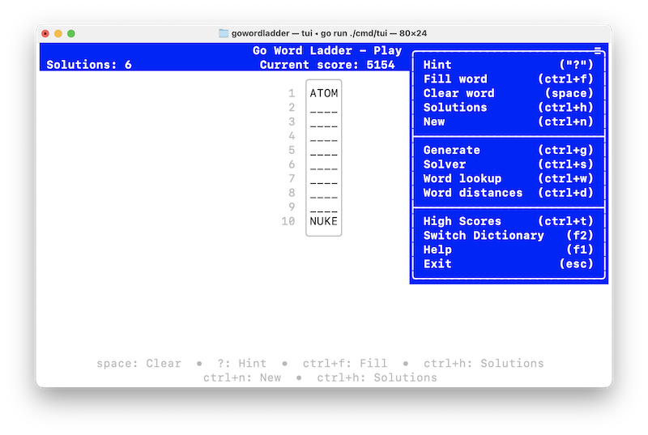

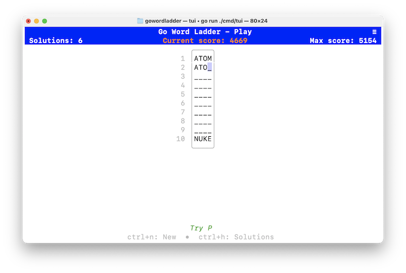
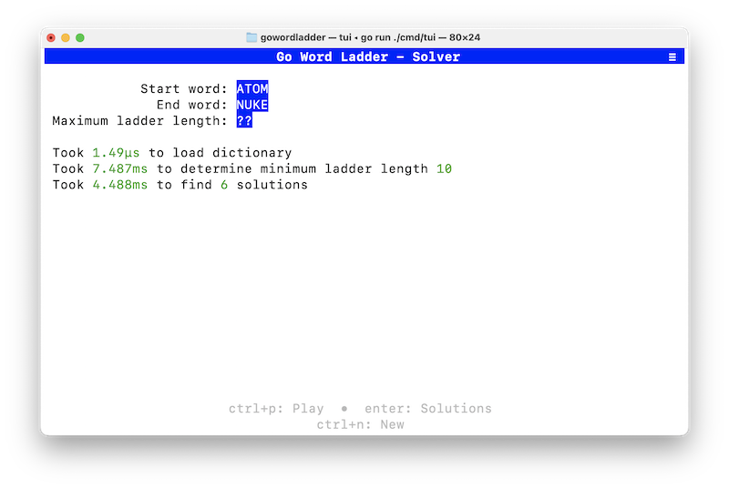
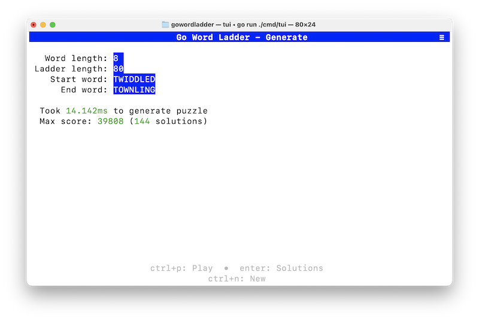
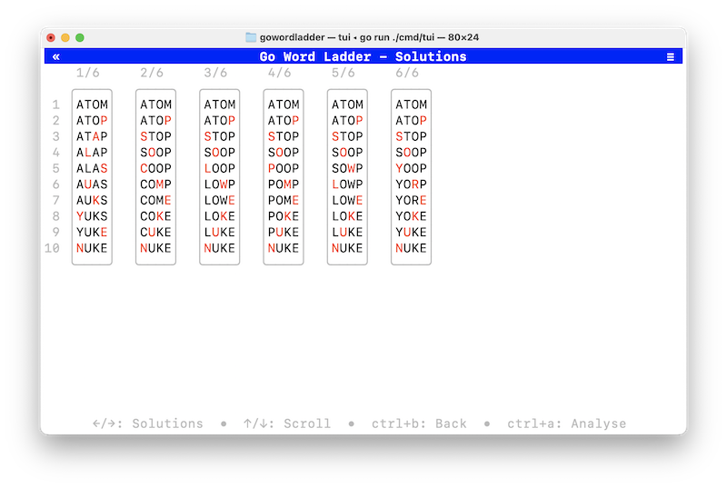
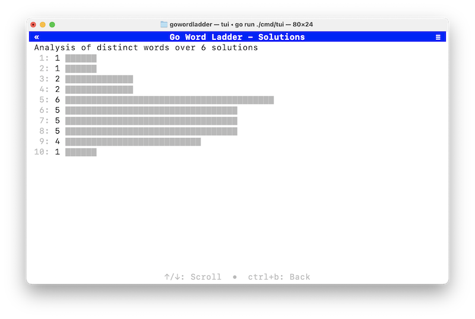

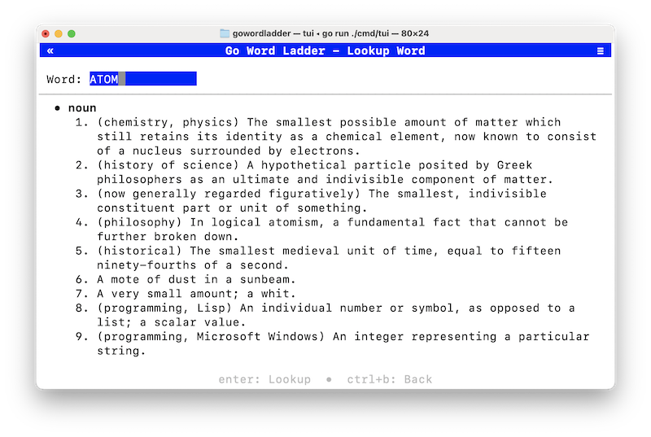
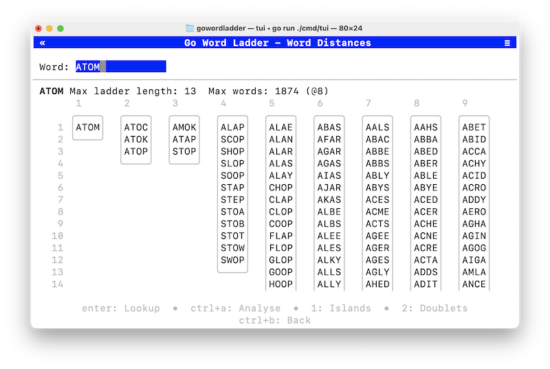
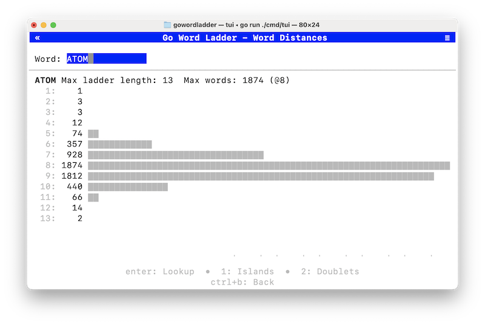
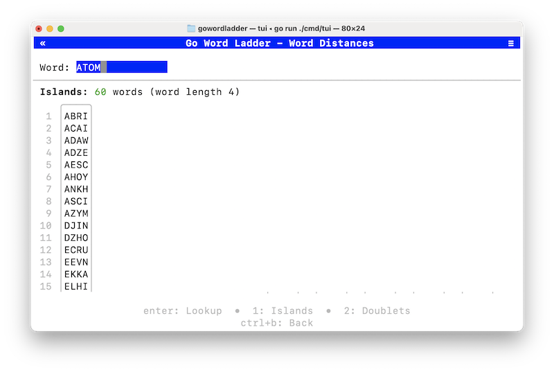
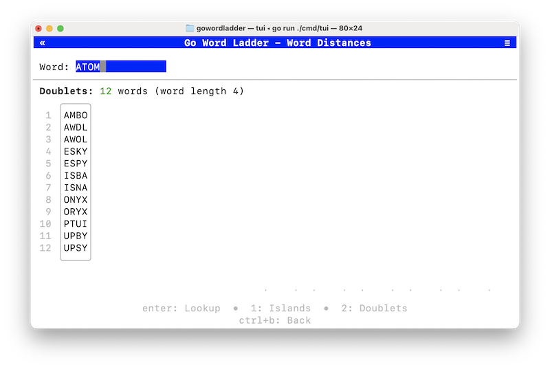
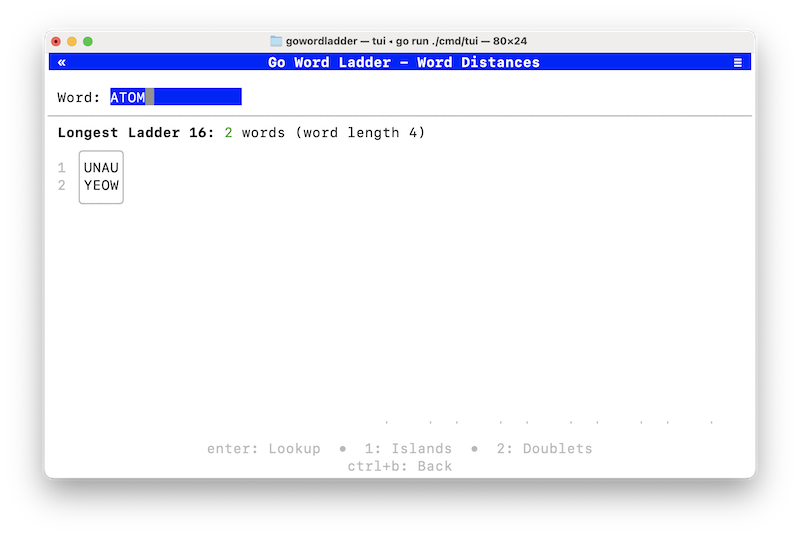
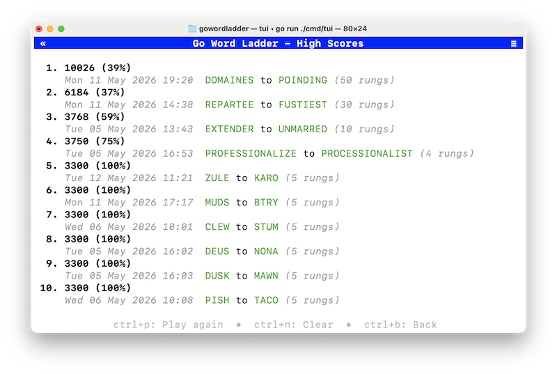
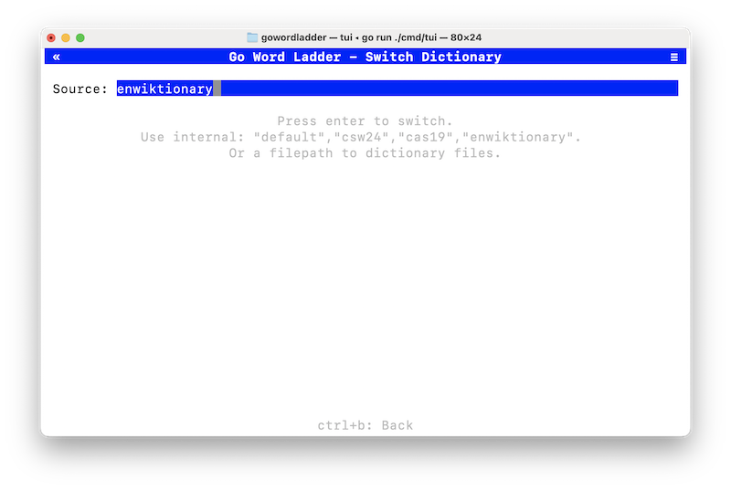
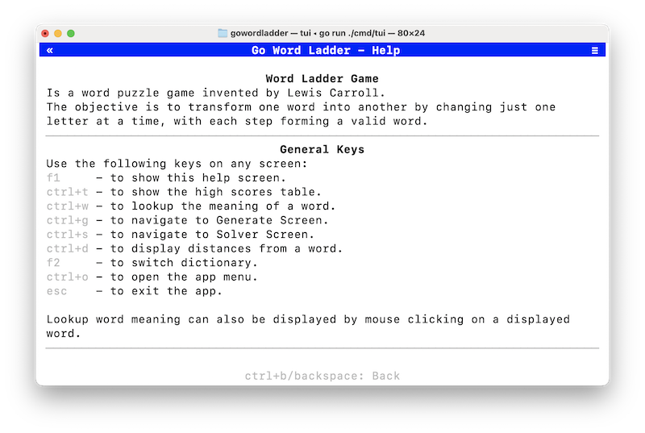
