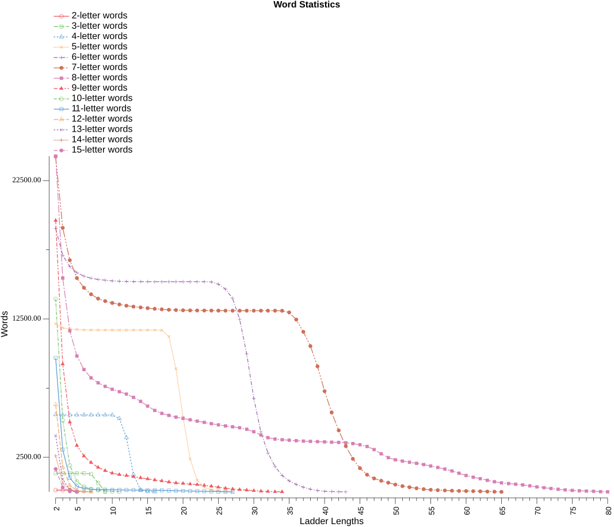
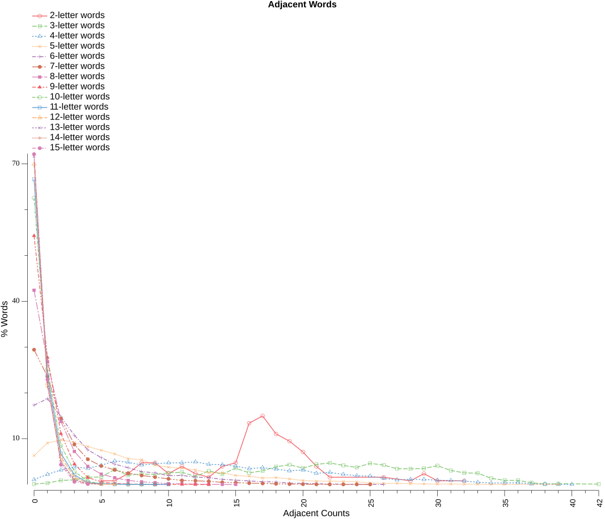

# Analysis Report

### Word statistics table

* Islands - are words that changing any letter will not form another word
* Doublets - are words that changing any letter will only form one other word
* LDS% (local decay smoothness) – the longest consecutive run of ladder lengths for which each word count is at least 95% of the previous ladder length’s count, expressed as a percentage of all ladder lengths in the dictionary
* Var – variance of consecutive count ratios, measuring how smoothly (low) or unevenly (high) word counts decay across ladder lengths
* Drop% – percentage decrease from ladder length 2 to 3, representing initial connectivity decay
* Longest - is the longest possible ladder length for the dictionary
* Numeric columns - are the number of words that can form that ladder length

| Letters | Words | Islands |   %  | Doublets |   %  | LDS% |  Var | Drop% | Longest |     2 |     3 |     4 |     5 |     6 |     7 |     8 |     9 |    10 |    11 |    12 |    13 |    14 |    15 |    16 |    17 |    18 |    19 |    20 |    21 |    22 |    23 |    24 |    25 |    26 |    27 |    28 |    29 |    30 |    31 |    32 |    33 |    34 |    35 |    36 |    37 |    38 |    39 |    40 |    41 |    42 |    43 |    44 |    45 |    46 |    47 |    48 |    49 |    50 |    51 |    52 |    53 |    54 |    55 |    56 |    57 |    58 |    59 |    60 |    61 |    62 |    63 |    64 |    65 |    66 |    67 |    68 |    69 |    70 |    71 |    72 |    73 |    74 |    75 |    76 |    77 |    78 |    79 |    80 |
|--------:|------:|--------:|-----:|---------:|-----:|-----:|-----:|------:|--------:|------:|------:|------:|------:|------:|------:|------:|------:|------:|------:|------:|------:|------:|------:|------:|------:|------:|------:|------:|------:|------:|------:|------:|------:|------:|------:|------:|------:|------:|------:|------:|------:|------:|------:|------:|------:|------:|------:|------:|------:|------:|------:|------:|------:|------:|------:|------:|------:|------:|------:|------:|------:|------:|------:|------:|------:|------:|------:|------:|------:|------:|------:|------:|------:|------:|------:|------:|------:|------:|------:|------:|------:|------:|------:|------:|------:|------:|------:|------:|
|       2 |   127 |       0 |  0.0 |        0 |  0.0 | 75.0 | 0.12 |   0.0 |       5 |   127 |   127 |   127 |    33 |       |       |       |       |       |       |       |       |       |       |       |       |       |       |       |       |       |       |       |       |       |       |       |       |       |       |       |       |       |       |       |       |       |       |       |       |       |       |       |       |       |       |       |       |       |       |       |       |       |       |       |       |       |       |       |       |       |       |       |       |       |       |       |       |       |       |       |       |       |       |       |       |       |       |       |
|       3 |  1347 |       1 |  0.1 |        0 |  0.0 | 75.0 | 0.12 |   0.0 |       9 |  1346 |  1346 |  1346 |  1346 |  1346 |  1292 |   648 |    16 |       |       |       |       |       |       |       |       |       |       |       |       |       |       |       |       |       |       |       |       |       |       |       |       |       |       |       |       |       |       |       |       |       |       |       |       |       |       |       |       |       |       |       |       |       |       |       |       |       |       |       |       |       |       |       |       |       |       |       |       |       |       |       |       |       |       |       |       |       |       |       |
|       4 |  5638 |      59 |  1.0 |       12 |  0.2 | 66.7 | 0.13 |   0.2 |      16 |  5579 |  5567 |  5563 |  5563 |  5563 |  5563 |  5563 |  5563 |  5562 |  5305 |  3923 |  1248 |   139 |    29 |     3 |       |       |       |       |       |       |       |       |       |       |       |       |       |       |       |       |       |       |       |       |       |       |       |       |       |       |       |       |       |       |       |       |       |       |       |       |       |       |       |       |       |       |       |       |       |       |       |       |       |       |       |       |       |       |       |       |       |       |       |       |       |       |       |       |
|       5 | 12972 |     814 |  6.3 |      303 |  2.3 | 65.4 | 0.07 |   2.5 |      27 | 12158 | 11855 | 11771 | 11736 | 11710 | 11700 | 11698 | 11695 | 11695 | 11695 | 11695 | 11695 | 11695 | 11695 | 11695 | 11687 | 11234 |  8903 |  5410 |  2383 |   849 |   334 |   146 |    76 |    33 |     8 |       |       |       |       |       |       |       |       |       |       |       |       |       |       |       |       |       |       |       |       |       |       |       |       |       |       |       |       |       |       |       |       |       |       |       |       |       |       |       |       |       |       |       |       |       |       |       |       |       |       |       |       |       |
|       6 | 23033 |    3986 | 17.3 |     1947 |  8.5 | 59.5 | 0.04 |  10.2 |      43 | 19047 | 17100 | 16282 | 15842 | 15597 | 15444 | 15353 | 15300 | 15250 | 15222 | 15209 | 15200 | 15196 | 15193 | 15191 | 15191 | 15191 | 15191 | 15191 | 15191 | 15191 | 15191 | 15174 | 15011 | 14658 | 13986 | 12474 |  9973 |  6752 |  4328 |  2815 |  1834 |  1190 |   793 |   539 |   336 |   196 |   100 |    45 |    24 |    10 |     3 |       |       |       |       |       |       |       |       |       |       |       |       |       |       |       |       |       |       |       |       |       |       |       |       |       |       |       |       |       |       |       |       |       |       |       |       |       |
|       7 | 34342 |   10103 | 29.4 |     5155 | 15.0 | 50.0 | 0.02 |  21.3 |      65 | 24239 | 19084 | 16747 | 15456 | 14755 | 14284 | 13970 | 13790 | 13655 | 13548 | 13456 | 13390 | 13332 | 13280 | 13233 | 13194 | 13164 | 13142 | 13126 | 13117 | 13111 | 13108 | 13105 | 13102 | 13100 | 13098 | 13098 | 13098 | 13098 | 13098 | 13098 | 13098 | 13091 | 12970 | 12453 | 11569 | 10537 |  9074 |  7280 |  5741 |  4446 |  3310 |  2388 |  1716 |  1244 |   973 |   806 |   666 |   529 |   418 |   337 |   261 |   197 |   153 |   126 |   104 |    86 |    70 |    61 |    53 |    41 |    26 |    14 |     2 |       |       |       |       |       |       |       |       |       |       |       |       |       |       |       |
|       8 | 42150 |   17877 | 42.4 |     8818 | 20.9 | 20.3 | 0.02 |  36.3 |      80 | 24273 | 15455 | 11641 |  9822 |  8844 |  8243 |  7883 |  7627 |  7414 |  7244 |  7071 |  6832 |  6542 |  6201 |  5891 |  5676 |  5528 |  5403 |  5311 |  5213 |  5113 |  5025 |  4932 |  4845 |  4768 |  4705 |  4637 |  4530 |  4351 |  4113 |  3918 |  3819 |  3771 |  3737 |  3701 |  3672 |  3651 |  3633 |  3614 |  3592 |  3576 |  3550 |  3493 |  3408 |  3284 |  3059 |  2755 |  2477 |  2321 |  2228 |  2143 |  2067 |  1978 |  1872 |  1767 |  1651 |  1513 |  1350 |  1186 |  1061 |   956 |   839 |   735 |   652 |   603 |   556 |   507 |   439 |   362 |   304 |   246 |   190 |   146 |   108 |    83 |    61 |    44 |    18 |     3 |
|       9 | 42933 |   23315 | 54.3 |    10380 | 24.2 |  0.0 | 0.03 |  52.9 |      34 | 19618 |  9238 |  5044 |  3352 |  2589 |  2123 |  1770 |  1537 |  1355 |  1251 |  1183 |  1103 |  1020 |   942 |   864 |   797 |   714 |   650 |   610 |   571 |   530 |   475 |   411 |   339 |   267 |   209 |   165 |   132 |    91 |    54 |    31 |    15 |     5 |       |       |       |       |       |       |       |       |       |       |       |       |       |       |       |       |       |       |       |       |       |       |       |       |       |       |       |       |       |       |       |       |       |       |       |       |       |       |       |       |       |       |       |       |       |       |
|      10 | 37235 |   23291 | 62.6 |     8765 | 23.5 |  0.0 | 0.01 |  62.9 |      11 | 13944 |  5179 |  1915 |   748 |   379 |   205 |   124 |    72 |    35 |    11 |       |       |       |       |       |       |       |       |       |       |       |       |       |       |       |       |       |       |       |       |       |       |       |       |       |       |       |       |       |       |       |       |       |       |       |       |       |       |       |       |       |       |       |       |       |       |       |       |       |       |       |       |       |       |       |       |       |       |       |       |       |       |       |       |       |       |       |       |       |
|      11 | 29027 |   19347 | 66.7 |     6620 | 22.8 | 15.4 | 0.05 |  68.4 |      27 |  9680 |  3060 |  1011 |   400 |   243 |   189 |   175 |   167 |   156 |   146 |   136 |   131 |   129 |   126 |   119 |   112 |    97 |    83 |    74 |    61 |    51 |    41 |    31 |    21 |    11 |     3 |       |       |       |       |       |       |       |       |       |       |       |       |       |       |       |       |       |       |       |       |       |       |       |       |       |       |       |       |       |       |       |       |       |       |       |       |       |       |       |       |       |       |       |       |       |       |       |       |       |       |       |       |       |
|      12 | 21025 |   14714 | 70.0 |     4516 | 21.5 |  0.0 | 0.00 |  71.6 |       7 |  6311 |  1795 |   457 |   107 |    37 |     7 |       |       |       |       |       |       |       |       |       |       |       |       |       |       |       |       |       |       |       |       |       |       |       |       |       |       |       |       |       |       |       |       |       |       |       |       |       |       |       |       |       |       |       |       |       |       |       |       |       |       |       |       |       |       |       |       |       |       |       |       |       |       |       |       |       |       |       |       |       |       |       |       |       |
|      13 | 14345 |   10281 | 71.7 |     3152 | 22.0 |  0.0 | 0.01 |  77.6 |       5 |  4064 |   912 |   181 |     9 |       |       |       |       |       |       |       |       |       |       |       |       |       |       |       |       |       |       |       |       |       |       |       |       |       |       |       |       |       |       |       |       |       |       |       |       |       |       |       |       |       |       |       |       |       |       |       |       |       |       |       |       |       |       |       |       |       |       |       |       |       |       |       |       |       |       |       |       |       |       |       |       |       |       |       |
|      14 |  9397 |    6788 | 72.2 |     1981 | 21.1 |  0.0 | 0.01 |  75.9 |       7 |  2609 |   628 |   172 |    20 |     7 |     2 |       |       |       |       |       |       |       |       |       |       |       |       |       |       |       |       |       |       |       |       |       |       |       |       |       |       |       |       |       |       |       |       |       |       |       |       |       |       |       |       |       |       |       |       |       |       |       |       |       |       |       |       |       |       |       |       |       |       |       |       |       |       |       |       |       |       |       |       |       |       |       |       |       |
|      15 |  5925 |    4273 | 72.1 |     1332 | 22.5 |  0.0 | 0.00 |  80.6 |       5 |  1652 |   320 |    43 |     2 |       |       |       |       |       |       |       |       |       |       |       |       |       |       |       |       |       |       |       |       |       |       |       |       |       |       |       |       |       |       |       |       |       |       |       |       |       |       |       |       |       |       |       |       |       |       |       |       |       |       |       |       |       |       |       |       |       |       |       |       |       |       |       |       |       |       |       |       |       |       |       |       |       |       |       |

Observation notes:
1. word - islands = ladder length 2 words
2. word - islands - doublets = ladder length 3 words

### Adjacent Counts Table

This table shows the spread of adjacent word counts for each word in the dictionary

| Letters |     0 |     1 |     2 |     3 |     4 |     5 |     6 |     7 |     8 |     9 |    10 |    11 |    12 |    13 |    14 |    15 |    16 |    17 |    18 |    19 |    20 |    21 |    22 |    23 |    24 |    25 |    26 |    27 |    28 |    29 |    30 |    31 |    32 |    33 |    34 |    35 |    36 |    37 |    38 |    39 |    40 |    41 |    42 |
|--------:|------:|------:|------:|------:|------:|------:|------:|------:|------:|------:|------:|------:|------:|------:|------:|------:|------:|------:|------:|------:|------:|------:|------:|------:|------:|------:|------:|------:|------:|------:|------:|------:|------:|------:|------:|------:|------:|------:|------:|------:|------:|------:|------:|
|       2 |       |       |       |       |       |     1 |     1 |     3 |     6 |     6 |     3 |     5 |     3 |     2 |     5 |     6 |    17 |    19 |    14 |    12 |     9 |     5 |     2 |       |       |       |     2 |       |     1 |     3 |     1 |       |     1 |       |       |       |       |       |       |       |       |       |       |
|       3 |     1 |     4 |    12 |    13 |    21 |    22 |    44 |    27 |    31 |    29 |    34 |    36 |    23 |    40 |    30 |    48 |    34 |    40 |    52 |    58 |    48 |    59 |    63 |    56 |    50 |    62 |    57 |    46 |    46 |    47 |    55 |    41 |    34 |    33 |    18 |    12 |    12 |     5 |     1 |     2 |       |       |     1 |
|       4 |    59 |   124 |   178 |   215 |   199 |   235 |   289 |   273 |   239 |   255 |   266 |   266 |   278 |   247 |   243 |   225 |   195 |   207 |   188 |   167 |   178 |   137 |   148 |   124 |   107 |   103 |    74 |    56 |    63 |    61 |    52 |    49 |    42 |    27 |    17 |    18 |    21 |     6 |     5 |     1 |     1 |       |       |
|       5 |   814 |  1174 |  1261 |  1188 |  1072 |   968 |   864 |   728 |   702 |   548 |   487 |   459 |   410 |   327 |   331 |   252 |   231 |   182 |   193 |   155 |   110 |    92 |    92 |    84 |    73 |    43 |    26 |    30 |    18 |    15 |     9 |    12 |     6 |     8 |     3 |     3 |       |       |       |     2 |       |       |       |
|       6 |  3986 |  4313 |  3400 |  2470 |  1739 |  1347 |  1019 |   841 |   644 |   582 |   438 |   453 |   367 |   341 |   255 |   217 |   174 |   136 |   123 |    66 |    51 |    30 |    21 |    11 |     5 |     3 |     1 |       |       |       |       |       |       |       |       |       |       |       |       |       |       |       |       |
|       7 | 10103 |  8089 |  4951 |  2996 |  1886 |  1382 |  1088 |   844 |   672 |   547 |   417 |   299 |   276 |   230 |   156 |   136 |    94 |    74 |    48 |    23 |    18 |     7 |     1 |     2 |     2 |     1 |       |       |       |       |       |       |       |       |       |       |       |       |       |       |       |       |       |
|       8 | 17877 | 11295 |  5796 |  3035 |  1660 |   948 |   612 |   367 |   239 |   165 |    69 |    58 |    21 |     5 |     2 |     1 |       |       |       |       |       |       |       |       |       |       |       |       |       |       |       |       |       |       |       |       |       |       |       |       |       |       |       |
|       9 | 23315 | 11907 |  4758 |  1912 |   647 |   240 |    85 |    36 |    20 |     7 |     1 |     3 |     1 |     1 |       |       |       |       |       |       |       |       |       |       |       |       |       |       |       |       |       |       |       |       |       |       |       |       |       |       |       |       |       |
|      10 | 23291 |  9382 |  3164 |  1070 |   244 |    62 |    17 |     3 |     1 |     1 |       |       |       |       |       |       |       |       |       |       |       |       |       |       |       |       |       |       |       |       |       |       |       |       |       |       |       |       |       |       |       |       |       |
|      11 | 19347 |  6928 |  1964 |   592 |   119 |    47 |    16 |    10 |     2 |     1 |     1 |       |       |       |       |       |       |       |       |       |       |       |       |       |       |       |       |       |       |       |       |       |       |       |       |       |       |       |       |       |       |       |       |
|      12 | 14714 |  4641 |  1268 |   330 |    61 |     9 |     2 |       |       |       |       |       |       |       |       |       |       |       |       |       |       |       |       |       |       |       |       |       |       |       |       |       |       |       |       |       |       |       |       |       |       |       |       |
|      13 | 10281 |  3216 |   675 |   146 |    23 |     4 |       |       |       |       |       |       |       |       |       |       |       |       |       |       |       |       |       |       |       |       |       |       |       |       |       |       |       |       |       |       |       |       |       |       |       |       |       |
|      14 |  6788 |  2003 |   488 |    91 |    19 |     8 |       |       |       |       |       |       |       |       |       |       |       |       |       |       |       |       |       |       |       |       |       |       |       |       |       |       |       |       |       |       |       |       |       |       |       |       |       |
|      15 |  4273 |  1358 |   255 |    34 |     5 |       |       |       |       |       |       |       |       |       |       |       |       |       |       |       |       |       |       |       |       |       |       |       |       |       |       |       |       |       |       |       |       |       |       |       |       |       |       |

### Longest Ladders

8-letter words yields the longest ladders (80)

|          |          |          |
|----------|----------|----------|
| `TOWNLING` | `TWIDDLED` | `TWIDDLER` |
| `TOWELING` | `TWIDDLES` | `TWIDDLES` |
| `TOWERING` | `TWADDLES` | `TWADDLES` |
| `DOWERING` | `SWADDLES` | `SWADDLES` |
| `DOVERING` | `STADDLES` | `STADDLES` |
| `DOVENING` | `STUDDLES` | `STUDDLES` |
| `DAVENING` | `STUDDIES` | `STUDDIES` |
| `RAVENING` | `STEDDIES` | `STEDDIES` |
| `RAVELING` | `STEEDIES` | `STEEDIES` |
| `REVELING` | `STEELIES` | `STEELIES` |
| `REVILING` | `STEELIER` | `STEELIER` |
| `RESILING` | `SKEELIER` | `SKEELIER` |
| `RESITING` | `SKELLIER` | `SKELLIER` |
| `REBITING` | `SKILLIER` | `SKILLIER` |
| `DEBITING` | `STILLIER` | `STILLIER` |
| `DEBUTING` | `STILTIER` | `STILTIER` |
| `DEPUTING` | `STINTIER` | `STINTIER` |
| `REPUTING` | `STINGIER` | `STINGIER` |
| `REPURING` | `SLINGIER` | `SLINGIER` |
| `RECURING` | `SLANGIER` | `SLANGIER` |
| `RECULING` | `SLANTIER` | `SLANTIER` |
| `RECKLING` | `SCANTIER` | `SCANTIER` |
| `RUCKLING` | `SCANTIES` | `SCANTIES` |
| `SUCKLING` | `SHANTIES` | `SHANTIES` |
| `SICKLING` | `SHANNIES` | `SHANNIES` |
| `TICKLING` | `SHARNIES` | `SHARNIES` |
| `TINKLING` | `SHARPIES` | `SHARPIES` |
| `WINKLING` | `CHARPIES` | `CHARPIES` |
| `WINDLING` | `CHAPPIES` | `CHAPPIES` |
| `WIDDLING` | `CRAPPIES` | `CRAPPIES` |
| `TIDDLING` | `CRAPPIER` | `CRAPPIER` |
| `TODDLING` | `CRAMPIER` | `CRAMPIER` |
| `TOODLING` | `CRIMPIER` | `CRIMPIER` |
| `TOOTLING` | `CRISPIER` | `CRISPIER` |
| `TOOTHING` | `CRISPIES` | `CRISPIES` |
| `TROTHING` | `CRISPINS` | `CRISPINS` |
| `TROTTING` | `CRISPING` | `CRISPING` |
| `TROUTING` | `CRIMPING` | `CRIMPING` |
| `TROUPING` | `CRUMPING` | `CRUMPING` |
| `TROMPING` | `TRUMPING` | `TRUMPING` |
| `TRUMPING` | `TROMPING` | `TROMPING` |
| `CRUMPING` | `TROUPING` | `TROUPING` |
| `CRIMPING` | `TROUTING` | `TROUTING` |
| `CRISPING` | `TROTTING` | `TROTTING` |
| `CRISPINS` | `TROTHING` | `TROTHING` |
| `CRISPIES` | `TOOTHING` | `TOOTHING` |
| `CRISPIER` | `TOOTLING` | `TOOTLING` |
| `CRIMPIER` | `TOODLING` | `TOODLING` |
| `CRAMPIER` | `TODDLING` | `TODDLING` |
| `CRAPPIER` | `TIDDLING` | `TIDDLING` |
| `CRAPPIES` | `WIDDLING` | `WIDDLING` |
| `CHAPPIES` | `WINDLING` | `WINDLING` |
| `CHARPIES` | `WINKLING` | `WINKLING` |
| `SHARPIES` | `TINKLING` | `TINKLING` |
| `SHARNIES` | `TICKLING` | `TICKLING` |
| `SHANNIES` | `SICKLING` | `TACKLING` |
| `SHANTIES` | `SUCKLING` | `HACKLING` |
| `SCANTIES` | `RUCKLING` | `HECKLING` |
| `SCANTIER` | `RECKLING` | `RECKLING` |
| `SLANTIER` | `RECULING` | `RECULING` |
| `SLANGIER` | `RECURING` | `RECURING` |
| `SLINGIER` | `REPURING` | `REPURING` |
| `STINGIER` | `REPUTING` | `REPUTING` |
| `STINTIER` | `DEPUTING` | `DEPUTING` |
| `STILTIER` | `DEBUTING` | `DEBUTING` |
| `STILLIER` | `DEBITING` | `DEBITING` |
| `SKILLIER` | `REBITING` | `REBITING` |
| `SKELLIER` | `RESITING` | `RESITING` |
| `SKEELIER` | `RESILING` | `RESILING` |
| `STEELIER` | `REVILING` | `REVILING` |
| `STEELIES` | `REVELING` | `REVELING` |
| `STEEDIES` | `RAVELING` | `RAVELING` |
| `STEDDIES` | `RAVENING` | `RAVENING` |
| `STUDDIES` | `DAVENING` | `DAVENING` |
| `STUDDLES` | `DOVENING` | `DOVENING` |
| `STADDLES` | `DOVERING` | `DOVERING` |
| `SWADDLES` | `DOWERING` | `DOWERING` |
| `TWADDLES` | `TOWERING` | `DOWELING` |
| `TWIDDLES` | `TOWELING` | `TOWELING` |
| `TWIDDLED` | `TOWNLING` | `TOWNLING` |
| 143 alternatives | 143 alternatives | 143 alternatives |