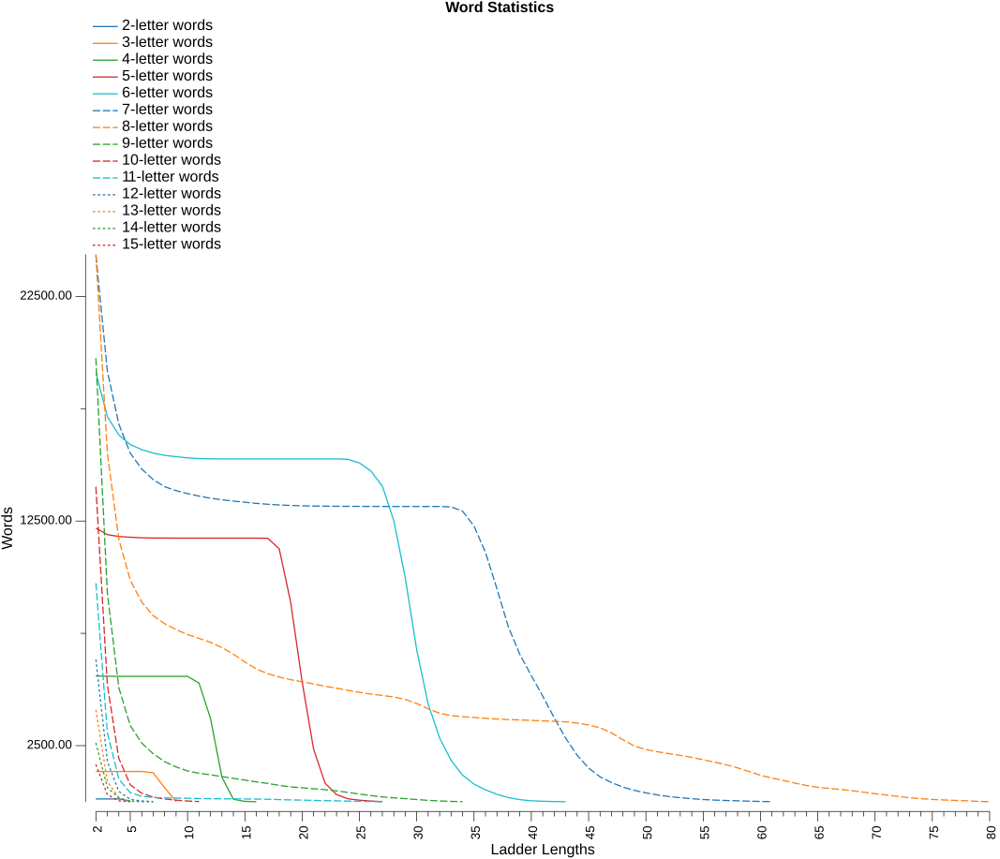
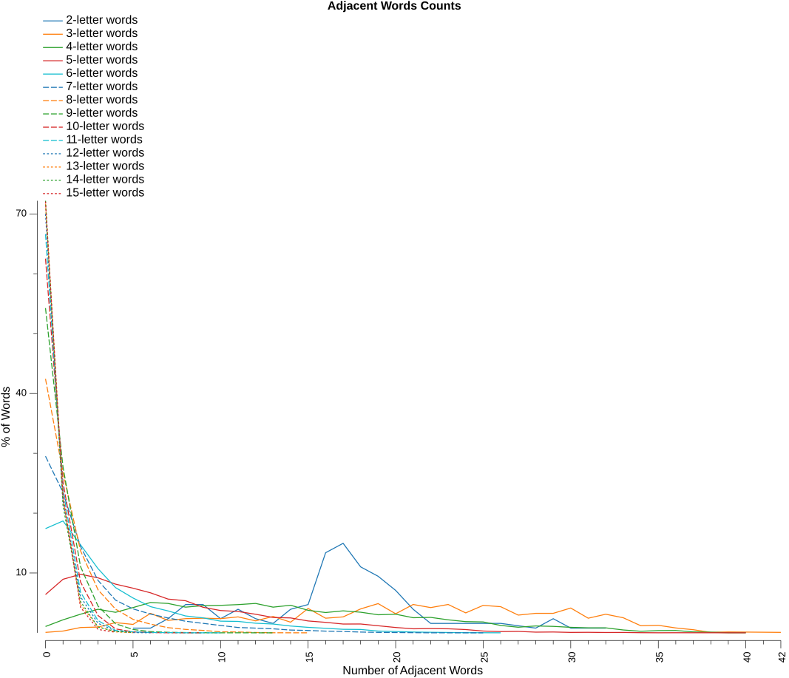

# Analysis Report

### Word Statistics

* Lexicon - based on CSW24
* Islands - are words that changing any letter will not form another word
* Doublets - are words that changing any letter will only form one other word
* LDS% (local decay smoothness) – the longest consecutive run of ladder lengths for which each word count is at least 95% of the previous ladder length’s count, expressed as a percentage of all ladder lengths in the dictionary
* Var – variance of consecutive count ratios, measuring how smoothly (low) or unevenly (high) word counts decay across ladder lengths
* Drop% – percentage decrease from ladder length 2 to 3, representing initial connectivity decay
* Longest - is the longest possible ladder length for the dictionary
* Numeric columns - are the number of words that can form that ladder length

| Letters | Words | Islands |   %  | Doublets |   %  | LDS% |  Var | Drop% | Longest |     2 |     3 |     4 |     5 |     6 |     7 |     8 |     9 |    10 |    11 |    12 |    13 |    14 |    15 |    16 |    17 |    18 |    19 |    20 |    21 |    22 |    23 |    24 |    25 |    26 |    27 |    28 |    29 |    30 |    31 |    32 |    33 |    34 |    35 |    36 |    37 |    38 |    39 |    40 |    41 |    42 |    43 |    44 |    45 |    46 |    47 |    48 |    49 |    50 |    51 |    52 |    53 |    54 |    55 |    56 |    57 |    58 |    59 |    60 |    61 |    62 |    63 |    64 |    65 |    66 |    67 |    68 |    69 |    70 |    71 |    72 |    73 |    74 |    75 |    76 |    77 |    78 |    79 |    80 |
|--------:|------:|--------:|-----:|---------:|-----:|-----:|-----:|------:|--------:|------:|------:|------:|------:|------:|------:|------:|------:|------:|------:|------:|------:|------:|------:|------:|------:|------:|------:|------:|------:|------:|------:|------:|------:|------:|------:|------:|------:|------:|------:|------:|------:|------:|------:|------:|------:|------:|------:|------:|------:|------:|------:|------:|------:|------:|------:|------:|------:|------:|------:|------:|------:|------:|------:|------:|------:|------:|------:|------:|------:|------:|------:|------:|------:|------:|------:|------:|------:|------:|------:|------:|------:|------:|------:|------:|------:|------:|------:|------:|
|       2 |   127 |       0 |  0.0 |        0 |  0.0 | 75.0 | 0.12 |   0.0 |       5 |   127 |   127 |   127 |    33 |       |       |       |       |       |       |       |       |       |       |       |       |       |       |       |       |       |       |       |       |       |       |       |       |       |       |       |       |       |       |       |       |       |       |       |       |       |       |       |       |       |       |       |       |       |       |       |       |       |       |       |       |       |       |       |       |       |       |       |       |       |       |       |       |       |       |       |       |       |       |       |       |       |       |       |
|       3 |  1351 |       1 |  0.1 |        0 |  0.0 | 75.0 | 0.13 |   0.0 |       9 |  1350 |  1350 |  1350 |  1350 |  1350 |  1292 |   627 |    14 |       |       |       |       |       |       |       |       |       |       |       |       |       |       |       |       |       |       |       |       |       |       |       |       |       |       |       |       |       |       |       |       |       |       |       |       |       |       |       |       |       |       |       |       |       |       |       |       |       |       |       |       |       |       |       |       |       |       |       |       |       |       |       |       |       |       |       |       |       |       |       |
|       4 |  5662 |      60 |  1.1 |       12 |  0.2 | 60.0 | 0.14 |   0.2 |      16 |  5602 |  5590 |  5586 |  5586 |  5586 |  5586 |  5586 |  5586 |  5585 |  5284 |  3718 |  1098 |   112 |    18 |     2 |       |       |       |       |       |       |       |       |       |       |       |       |       |       |       |       |       |       |       |       |       |       |       |       |       |       |       |       |       |       |       |       |       |       |       |       |       |       |       |       |       |       |       |       |       |       |       |       |       |       |       |       |       |       |       |       |       |       |       |       |       |       |       |       |
|       5 | 13018 |     833 |  6.4 |      291 |  2.2 | 65.4 | 0.07 |   2.4 |      27 | 12185 | 11894 | 11812 | 11778 | 11753 | 11743 | 11741 | 11738 | 11738 | 11738 | 11738 | 11738 | 11738 | 11738 | 11738 | 11730 | 11263 |  8882 |  5342 |  2341 |   832 |   322 |   135 |    72 |    32 |     8 |       |       |       |       |       |       |       |       |       |       |       |       |       |       |       |       |       |       |       |       |       |       |       |       |       |       |       |       |       |       |       |       |       |       |       |       |       |       |       |       |       |       |       |       |       |       |       |       |       |       |       |       |       |
|       6 | 23140 |    4030 | 17.4 |     1958 |  8.5 | 59.5 | 0.04 |  10.2 |      43 | 19110 | 17152 | 16328 | 15906 | 15678 | 15524 | 15423 | 15365 | 15312 | 15281 | 15270 | 15266 | 15266 | 15266 | 15266 | 15266 | 15266 | 15266 | 15266 | 15266 | 15266 | 15266 | 15249 | 15084 | 14726 | 14052 | 12514 |  9975 |  6764 |  4348 |  2839 |  1844 |  1186 |   788 |   535 |   333 |   190 |    96 |    44 |    24 |    10 |     3 |       |       |       |       |       |       |       |       |       |       |       |       |       |       |       |       |       |       |       |       |       |       |       |       |       |       |       |       |       |       |       |       |       |       |       |       |       |
|       7 | 34506 |   10182 | 29.5 |     5148 | 14.9 | 50.0 | 0.02 |  21.2 |      61 | 24324 | 19176 | 16816 | 15523 | 14817 | 14343 | 14028 | 13853 | 13720 | 13610 | 13515 | 13446 | 13388 | 13336 | 13286 | 13246 | 13215 | 13193 | 13176 | 13167 | 13161 | 13158 | 13155 | 13152 | 13150 | 13148 | 13148 | 13148 | 13148 | 13148 | 13147 | 13127 | 12938 | 12276 | 11103 |  9485 |  7783 |  6562 |  5619 |  4701 |  3740 |  2830 |  2075 |  1502 |  1110 |   857 |   655 |   507 |   396 |   304 |   234 |   181 |   137 |   101 |    76 |    58 |    44 |    28 |    16 |     3 |       |       |       |       |       |       |       |       |       |       |       |       |       |       |       |       |       |       |       |
|       8 | 42341 |   17969 | 42.4 |     8839 | 20.9 | 20.3 | 0.02 |  36.3 |      80 | 24372 | 15533 | 11691 |  9869 |  8890 |  8289 |  7927 |  7663 |  7448 |  7275 |  7101 |  6864 |  6572 |  6226 |  5913 |  5701 |  5555 |  5435 |  5343 |  5245 |  5145 |  5057 |  4963 |  4874 |  4796 |  4733 |  4665 |  4557 |  4377 |  4139 |  3941 |  3840 |  3789 |  3753 |  3716 |  3686 |  3661 |  3643 |  3624 |  3602 |  3586 |  3560 |  3503 |  3418 |  3294 |  3067 |  2760 |  2480 |  2323 |  2229 |  2143 |  2067 |  1978 |  1871 |  1765 |  1650 |  1511 |  1346 |  1181 |  1056 |   952 |   831 |   727 |   645 |   595 |   548 |   495 |   428 |   359 |   300 |   240 |   182 |   140 |   105 |    81 |    61 |    44 |    18 |     3 |
|       9 | 43180 |   23433 | 54.3 |    10451 | 24.2 |  0.0 | 0.03 |  52.9 |      34 | 19747 |  9296 |  5083 |  3391 |  2614 |  2141 |  1785 |  1552 |  1373 |  1271 |  1202 |  1122 |  1043 |   966 |   886 |   817 |   730 |   663 |   622 |   581 |   539 |   484 |   418 |   344 |   274 |   218 |   174 |   141 |   100 |    63 |    39 |    19 |     6 |       |       |       |       |       |       |       |       |       |       |       |       |       |       |       |       |       |       |       |       |       |       |       |       |       |       |       |       |       |       |       |       |       |       |       |       |       |       |       |       |       |       |       |       |       |       |
|      10 | 37434 |   23410 | 62.5 |     8813 | 23.5 |  0.0 | 0.01 |  62.8 |      11 | 14024 |  5211 |  1931 |   758 |   380 |   205 |   124 |    72 |    35 |    11 |       |       |       |       |       |       |       |       |       |       |       |       |       |       |       |       |       |       |       |       |       |       |       |       |       |       |       |       |       |       |       |       |       |       |       |       |       |       |       |       |       |       |       |       |       |       |       |       |       |       |       |       |       |       |       |       |       |       |       |       |       |       |       |       |       |       |       |       |       |
|      11 | 29175 |   19439 | 66.6 |     6657 | 22.8 | 15.4 | 0.05 |  68.4 |      27 |  9736 |  3079 |  1017 |   404 |   245 |   190 |   176 |   168 |   157 |   147 |   137 |   132 |   130 |   127 |   120 |   113 |    98 |    84 |    75 |    62 |    52 |    42 |    31 |    21 |    11 |     3 |       |       |       |       |       |       |       |       |       |       |       |       |       |       |       |       |       |       |       |       |       |       |       |       |       |       |       |       |       |       |       |       |       |       |       |       |       |       |       |       |       |       |       |       |       |       |       |       |       |       |       |       |       |
|      12 | 21125 |   14789 | 70.0 |     4534 | 21.5 |  0.0 | 0.00 |  71.6 |       7 |  6336 |  1802 |   461 |   107 |    37 |     7 |       |       |       |       |       |       |       |       |       |       |       |       |       |       |       |       |       |       |       |       |       |       |       |       |       |       |       |       |       |       |       |       |       |       |       |       |       |       |       |       |       |       |       |       |       |       |       |       |       |       |       |       |       |       |       |       |       |       |       |       |       |       |       |       |       |       |       |       |       |       |       |       |       |
|      13 | 14435 |   10344 | 71.7 |     3174 | 22.0 |  0.0 | 0.01 |  77.6 |       5 |  4091 |   917 |   181 |     9 |       |       |       |       |       |       |       |       |       |       |       |       |       |       |       |       |       |       |       |       |       |       |       |       |       |       |       |       |       |       |       |       |       |       |       |       |       |       |       |       |       |       |       |       |       |       |       |       |       |       |       |       |       |       |       |       |       |       |       |       |       |       |       |       |       |       |       |       |       |       |       |       |       |       |       |
|      14 |  9437 |    6814 | 72.2 |     1989 | 21.1 |  0.0 | 0.01 |  75.8 |       7 |  2623 |   634 |   175 |    20 |     7 |     2 |       |       |       |       |       |       |       |       |       |       |       |       |       |       |       |       |       |       |       |       |       |       |       |       |       |       |       |       |       |       |       |       |       |       |       |       |       |       |       |       |       |       |       |       |       |       |       |       |       |       |       |       |       |       |       |       |       |       |       |       |       |       |       |       |       |       |       |       |       |       |       |       |       |
|      15 |  5956 |    4292 | 72.1 |     1344 | 22.6 |  0.0 | 0.00 |  80.8 |       5 |  1664 |   320 |    43 |     2 |       |       |       |       |       |       |       |       |       |       |       |       |       |       |       |       |       |       |       |       |       |       |       |       |       |       |       |       |       |       |       |       |       |       |       |       |       |       |       |       |       |       |       |       |       |       |       |       |       |       |       |       |       |       |       |       |       |       |       |       |       |       |       |       |       |       |       |       |       |       |       |       |       |       |       |

Observation notes:
1. word - islands = ladder length 2 words
2. word - islands - doublets = ladder length 3 words

### Adjacent Words Counts

This table shows the spread of adjacent word counts for each word in the dictionary.
* Words are considered adjacent if changing just one letter in one word forms the other word.

| Letters |     0 |     1 |     2 |     3 |     4 |     5 |     6 |     7 |     8 |     9 |    10 |    11 |    12 |    13 |    14 |    15 |    16 |    17 |    18 |    19 |    20 |    21 |    22 |    23 |    24 |    25 |    26 |    27 |    28 |    29 |    30 |    31 |    32 |    33 |    34 |    35 |    36 |    37 |    38 |    39 |    40 |    41 |    42 |
|--------:|------:|------:|------:|------:|------:|------:|------:|------:|------:|------:|------:|------:|------:|------:|------:|------:|------:|------:|------:|------:|------:|------:|------:|------:|------:|------:|------:|------:|------:|------:|------:|------:|------:|------:|------:|------:|------:|------:|------:|------:|------:|------:|------:|
|       2 |       |       |       |       |       |     1 |     1 |     3 |     6 |     6 |     3 |     5 |     3 |     2 |     5 |     6 |    17 |    19 |    14 |    12 |     9 |     5 |     2 |       |       |       |     2 |       |     1 |     3 |     1 |       |     1 |       |       |       |       |       |       |       |       |       |       |
|       3 |     1 |     4 |    12 |    13 |    23 |    19 |    44 |    28 |    32 |    33 |    32 |    36 |    27 |    37 |    24 |    55 |    33 |    36 |    54 |    66 |    43 |    64 |    57 |    64 |    45 |    62 |    59 |    40 |    44 |    44 |    56 |    33 |    42 |    34 |    16 |    17 |    11 |     7 |     1 |     2 |       |       |     1 |
|       4 |    60 |   123 |   176 |   223 |   194 |   239 |   287 |   278 |   243 |   257 |   260 |   267 |   278 |   243 |   261 |   213 |   192 |   208 |   195 |   171 |   176 |   143 |   146 |   123 |   106 |   103 |    70 |    53 |    65 |    61 |    52 |    47 |    47 |    27 |    15 |    21 |    22 |     9 |     6 |     1 |     1 |       |       |
|       5 |   833 |  1165 |  1274 |  1196 |  1059 |   971 |   870 |   734 |   698 |   556 |   485 |   464 |   404 |   334 |   324 |   258 |   228 |   191 |   192 |   154 |   116 |    88 |    92 |    88 |    71 |    39 |    27 |    31 |    15 |    18 |     9 |    11 |     7 |     8 |     3 |     1 |     2 |       |       |     1 |     1 |       |       |
|       6 |  4030 |  4326 |  3404 |  2481 |  1749 |  1347 |  1012 |   847 |   652 |   578 |   451 |   441 |   371 |   340 |   263 |   212 |   175 |   136 |   130 |    69 |    51 |    31 |    21 |    13 |     6 |     3 |     1 |       |       |       |       |       |       |       |       |       |       |       |       |       |       |       |       |
|       7 | 10182 |  8094 |  4978 |  3023 |  1886 |  1381 |  1082 |   855 |   669 |   546 |   425 |   308 |   272 |   231 |   160 |   135 |    98 |    78 |    44 |    26 |    17 |    10 |     1 |     2 |     2 |     1 |       |       |       |       |       |       |       |       |       |       |       |       |       |       |       |       |       |
|       8 | 17969 | 11336 |  5808 |  3043 |  1677 |   954 |   615 |   367 |   242 |   170 |    71 |    57 |    23 |     6 |     2 |     1 |       |       |       |       |       |       |       |       |       |       |       |       |       |       |       |       |       |       |       |       |       |       |       |       |       |       |       |
|       9 | 23433 | 11978 |  4787 |  1930 |   655 |   240 |    87 |    37 |    20 |     7 |     1 |     3 |     1 |     1 |       |       |       |       |       |       |       |       |       |       |       |       |       |       |       |       |       |       |       |       |       |       |       |       |       |       |       |       |       |
|      10 | 23410 |  9427 |  3187 |  1081 |   245 |    62 |    17 |     3 |     1 |     1 |       |       |       |       |       |       |       |       |       |       |       |       |       |       |       |       |       |       |       |       |       |       |       |       |       |       |       |       |       |       |       |       |       |
|      11 | 19439 |  6961 |  1982 |   596 |   119 |    48 |    16 |    10 |     2 |     1 |     1 |       |       |       |       |       |       |       |       |       |       |       |       |       |       |       |       |       |       |       |       |       |       |       |       |       |       |       |       |       |       |       |       |
|      12 | 14789 |  4654 |  1273 |   335 |    63 |     9 |     2 |       |       |       |       |       |       |       |       |       |       |       |       |       |       |       |       |       |       |       |       |       |       |       |       |       |       |       |       |       |       |       |       |       |       |       |       |
|      13 | 10344 |  3237 |   680 |   147 |    23 |     4 |       |       |       |       |       |       |       |       |       |       |       |       |       |       |       |       |       |       |       |       |       |       |       |       |       |       |       |       |       |       |       |       |       |       |       |       |       |
|      14 |  6814 |  2011 |   493 |    91 |    20 |     8 |       |       |       |       |       |       |       |       |       |       |       |       |       |       |       |       |       |       |       |       |       |       |       |       |       |       |       |       |       |       |       |       |       |       |       |       |       |
|      15 |  4292 |  1370 |   255 |    34 |     5 |       |       |       |       |       |       |       |       |       |       |       |       |       |       |       |       |       |       |       |       |       |       |       |       |       |       |       |       |       |       |       |       |       |       |       |       |       |       |

### Longest Ladders

#### 2-letter words

* _**33**_ words at maximum ladder length _**5**_
* `BA`, `BO`, `DA`, `DO`, `EL`, `ET`, `FA`, `GO`, `GU`, `IT`, `JA`, `JO`, `KA`, `KO`, `LA`, `LO`, `NA`, `NO`, `NU`, `PA`, `PO`, `TA`, `TO`, `UG`, `UP`, `UT`, `WO`, `XU`, `YA`, `YO`, `YU`, `ZA`, `ZO`

#### 3-letter words

* _**14**_ words at maximum ladder length _**9**_
* `EXO`, `ISM`, `IVY`, `JIB`, `JIZ`, `KEB`, `KEF`, `KEX`, `KEY`, `MIB`, `MIZ`, `MYC`, `UEY`, `ZZZ`

#### 4-letter words

* _**2**_ words at maximum ladder length _**16**_
* `UNAU`, `YEOW`

#### 5-letter words

* _**8**_ words at maximum ladder length _**27**_
* `ANKHS`, `APIAN`, `APPEL`, `INPUT`, `SUHUR`, `UNAIS`, `UNAPT`, `UPDOS`

#### 6-letter words

* _**3**_ words at maximum ladder length _**43**_
* `ANEATH`, `EMBOIL`, `UNEATH`

#### 7-letter words

* _**3**_ words at maximum ladder length _**61**_
* `HAGFISH`, `INJECTS`, `WAGGISH`

#### 8-letter words

* _**3**_ words at maximum ladder length _**80**_
* `TOWNLING`, `TWIDDLED`, `TWIDDLER`

#### 9-letter words

* _**6**_ words at maximum ladder length _**34**_
* `BREEDINGS`, `HAINCHING`, `POUNCHING`, `SCANNINGS`, `SCUMMINGS`, `SMEETHING`

#### 10-letter words

* _**11**_ words at maximum ladder length _**11**_
* `BLISTERING`, `DOXOLOGIES`, `GLISTENING`, `HOMOLOGUES`, `HOROLOGIES`, `MONOLOGGED`, `NOSOLOGIST`, `OPTOLOGIES`, `OPTOLOGIST`, `SNOTTERING`, `STOITERING`

#### 11-letter words

* _**3**_ words at maximum ladder length _**27**_
* `DODGINESSES`, `NERVINESSES`, `PODGINESSES`

#### 12-letter words

* _**7**_ words at maximum ladder length _**7**_
* `MATERIALIZED`, `MATERIALIZER`, `METROLOGISTS`, `PATERNALISTS`, `PATHOLOGIZED`, `ROOFLESSNESS`, `WORKLESSNESS`

#### 13-letter words

* _**9**_ words at maximum ladder length _**5**_
* `BASIFICATIONS`, `BEARISHNESSES`, `BLOKISHNESSES`, `EXPANDABILITY`, `EXTENSIBILITY`, `FACTIONALISMS`, `FACTIONALISTS`, `FICTIONALIZED`, `RATIFICATIONS`

#### 14-letter words

* _**2**_ words at maximum ladder length _**7**_
* `ROOFLESSNESSES`, `WORKLESSNESSES`

#### 15-letter words

* _**2**_ words at maximum ladder length _**5**_
* `EXPANDABILITIES`, `EXTENSIBILITIES`

