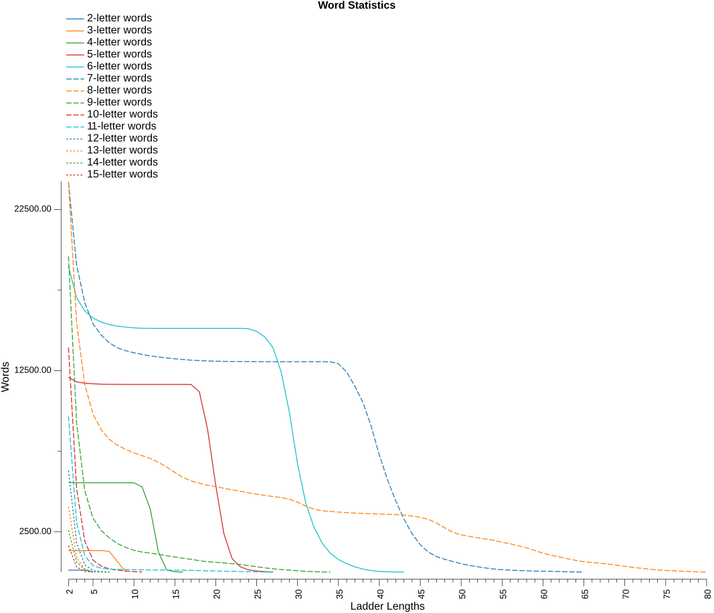
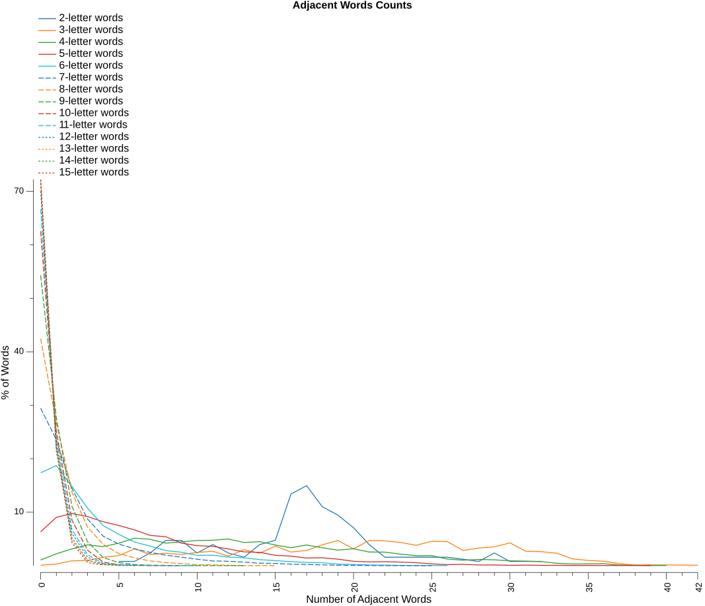

# Analysis Report

### Word Statistics

* Lexicon - based on CSW21
* Islands - are words that changing any letter will not form another word
* Doublets - are words that changing any letter will only form one other word
* LDS% (local decay smoothness) – the longest consecutive run of ladder lengths for which each word count is at least 95% of the previous ladder length’s count, expressed as a percentage of all ladder lengths in the dictionary
* Var – variance of consecutive count ratios, measuring how smoothly (low) or unevenly (high) word counts decay across ladder lengths
* Drop% – percentage decrease from ladder length 2 to 3, representing initial connectivity decay
* Longest - is the longest possible ladder length for the dictionary
* Numeric columns - are the number of words that can form that ladder length

| Letters | Words | Islands |   %  | Doublets |   %  | LDS% |  Var | Drop% | Longest |     2 |     3 |     4 |     5 |     6 |     7 |     8 |     9 |    10 |    11 |    12 |    13 |    14 |    15 |    16 |    17 |    18 |    19 |    20 |    21 |    22 |    23 |    24 |    25 |    26 |    27 |    28 |    29 |    30 |    31 |    32 |    33 |    34 |    35 |    36 |    37 |    38 |    39 |    40 |    41 |    42 |    43 |    44 |    45 |    46 |    47 |    48 |    49 |    50 |    51 |    52 |    53 |    54 |    55 |    56 |    57 |    58 |    59 |    60 |    61 |    62 |    63 |    64 |    65 |    66 |    67 |    68 |    69 |    70 |    71 |    72 |    73 |    74 |    75 |    76 |    77 |    78 |    79 |    80 |
|--------:|------:|--------:|-----:|---------:|-----:|-----:|-----:|------:|--------:|------:|------:|------:|------:|------:|------:|------:|------:|------:|------:|------:|------:|------:|------:|------:|------:|------:|------:|------:|------:|------:|------:|------:|------:|------:|------:|------:|------:|------:|------:|------:|------:|------:|------:|------:|------:|------:|------:|------:|------:|------:|------:|------:|------:|------:|------:|------:|------:|------:|------:|------:|------:|------:|------:|------:|------:|------:|------:|------:|------:|------:|------:|------:|------:|------:|------:|------:|------:|------:|------:|------:|------:|------:|------:|------:|------:|------:|------:|------:|
|       2 |   127 |       0 |  0.0 |        0 |  0.0 | 75.0 | 0.12 |   0.0 |       5 |   127 |   127 |   127 |    33 |       |       |       |       |       |       |       |       |       |       |       |       |       |       |       |       |       |       |       |       |       |       |       |       |       |       |       |       |       |       |       |       |       |       |       |       |       |       |       |       |       |       |       |       |       |       |       |       |       |       |       |       |       |       |       |       |       |       |       |       |       |       |       |       |       |       |       |       |       |       |       |       |       |       |       |
|       3 |  1340 |       1 |  0.1 |        0 |  0.0 | 75.0 | 0.12 |   0.0 |       9 |  1339 |  1339 |  1339 |  1339 |  1339 |  1285 |   643 |    16 |       |       |       |       |       |       |       |       |       |       |       |       |       |       |       |       |       |       |       |       |       |       |       |       |       |       |       |       |       |       |       |       |       |       |       |       |       |       |       |       |       |       |       |       |       |       |       |       |       |       |       |       |       |       |       |       |       |       |       |       |       |       |       |       |       |       |       |       |       |       |       |
|       4 |  5620 |      59 |  1.0 |       12 |  0.2 | 66.7 | 0.13 |   0.2 |      16 |  5561 |  5549 |  5545 |  5545 |  5545 |  5545 |  5545 |  5545 |  5544 |  5288 |  3913 |  1248 |   139 |    28 |     3 |       |       |       |       |       |       |       |       |       |       |       |       |       |       |       |       |       |       |       |       |       |       |       |       |       |       |       |       |       |       |       |       |       |       |       |       |       |       |       |       |       |       |       |       |       |       |       |       |       |       |       |       |       |       |       |       |       |       |       |       |       |       |       |       |
|       5 | 12915 |     817 |  6.3 |      296 |  2.3 | 65.4 | 0.07 |   2.4 |      27 | 12098 | 11802 | 11719 | 11687 | 11662 | 11652 | 11650 | 11647 | 11647 | 11647 | 11647 | 11647 | 11647 | 11647 | 11647 | 11639 | 11187 |  8868 |  5394 |  2382 |   844 |   334 |   145 |    75 |    33 |     8 |       |       |       |       |       |       |       |       |       |       |       |       |       |       |       |       |       |       |       |       |       |       |       |       |       |       |       |       |       |       |       |       |       |       |       |       |       |       |       |       |       |       |       |       |       |       |       |       |       |       |       |       |       |
|       6 | 22957 |    3987 | 17.4 |     1948 |  8.5 | 59.5 | 0.04 |  10.3 |      43 | 18970 | 17022 | 16200 | 15764 | 15517 | 15356 | 15257 | 15202 | 15154 | 15130 | 15122 | 15120 | 15120 | 15120 | 15120 | 15120 | 15120 | 15120 | 15120 | 15120 | 15120 | 15120 | 15103 | 14940 | 14588 | 13922 | 12416 |  9921 |  6720 |  4302 |  2794 |  1813 |  1172 |   780 |   530 |   333 |   193 |   100 |    45 |    24 |    10 |     3 |       |       |       |       |       |       |       |       |       |       |       |       |       |       |       |       |       |       |       |       |       |       |       |       |       |       |       |       |       |       |       |       |       |       |       |       |       |
|       7 | 34254 |   10087 | 29.4 |     5138 | 15.0 | 50.0 | 0.02 |  21.3 |      65 | 24167 | 19029 | 16698 | 15406 | 14701 | 14227 | 13913 | 13738 | 13609 | 13504 | 13414 | 13348 | 13290 | 13238 | 13191 | 13152 | 13122 | 13100 | 13084 | 13075 | 13069 | 13066 | 13063 | 13060 | 13058 | 13056 | 13056 | 13056 | 13056 | 13056 | 13056 | 13056 | 13049 | 12932 | 12418 | 11542 | 10517 |  9055 |  7261 |  5721 |  4430 |  3298 |  2377 |  1707 |  1235 |   966 |   800 |   661 |   526 |   418 |   336 |   260 |   196 |   152 |   125 |   103 |    85 |    69 |    60 |    52 |    40 |    25 |    14 |     3 |       |       |       |       |       |       |       |       |       |       |       |       |       |       |       |
|       8 | 42089 |   17857 | 42.4 |     8800 | 20.9 | 20.3 | 0.02 |  36.3 |      80 | 24232 | 15432 | 11621 |  9807 |  8830 |  8229 |  7869 |  7613 |  7399 |  7228 |  7055 |  6816 |  6527 |  6186 |  5875 |  5661 |  5518 |  5395 |  5303 |  5205 |  5105 |  5017 |  4924 |  4837 |  4760 |  4697 |  4629 |  4522 |  4343 |  4105 |  3910 |  3811 |  3763 |  3729 |  3693 |  3664 |  3643 |  3625 |  3606 |  3584 |  3568 |  3542 |  3485 |  3400 |  3276 |  3051 |  2747 |  2469 |  2313 |  2220 |  2135 |  2059 |  1970 |  1864 |  1759 |  1643 |  1505 |  1342 |  1178 |  1053 |   949 |   833 |   730 |   647 |   598 |   552 |   503 |   435 |   358 |   300 |   242 |   186 |   142 |   105 |    81 |    61 |    44 |    18 |     3 |
|       9 | 42890 |   23293 | 54.3 |    10366 | 24.2 |  0.0 | 0.03 |  52.9 |      34 | 19597 |  9231 |  5034 |  3349 |  2587 |  2123 |  1770 |  1537 |  1355 |  1251 |  1183 |  1103 |  1020 |   942 |   864 |   797 |   714 |   650 |   610 |   571 |   530 |   475 |   411 |   339 |   267 |   209 |   165 |   132 |    91 |    54 |    31 |    15 |     5 |       |       |       |       |       |       |       |       |       |       |       |       |       |       |       |       |       |       |       |       |       |       |       |       |       |       |       |       |       |       |       |       |       |       |       |       |       |       |       |       |       |       |       |       |       |       |
|      10 | 37196 |   23262 | 62.5 |     8760 | 23.6 |  0.0 | 0.01 |  62.9 |      11 | 13934 |  5174 |  1915 |   748 |   379 |   205 |   124 |    72 |    35 |    11 |       |       |       |       |       |       |       |       |       |       |       |       |       |       |       |       |       |       |       |       |       |       |       |       |       |       |       |       |       |       |       |       |       |       |       |       |       |       |       |       |       |       |       |       |       |       |       |       |       |       |       |       |       |       |       |       |       |       |       |       |       |       |       |       |       |       |       |       |       |
|      11 | 29010 |   19335 | 66.6 |     6617 | 22.8 | 15.4 | 0.05 |  68.4 |      27 |  9675 |  3058 |  1011 |   400 |   243 |   189 |   175 |   167 |   156 |   146 |   136 |   131 |   129 |   126 |   119 |   112 |    97 |    83 |    74 |    61 |    51 |    41 |    31 |    21 |    11 |     3 |       |       |       |       |       |       |       |       |       |       |       |       |       |       |       |       |       |       |       |       |       |       |       |       |       |       |       |       |       |       |       |       |       |       |       |       |       |       |       |       |       |       |       |       |       |       |       |       |       |       |       |       |       |
|      12 | 21016 |   14712 | 70.0 |     4511 | 21.5 |  0.0 | 0.00 |  71.6 |       7 |  6304 |  1793 |   457 |   107 |    37 |     7 |       |       |       |       |       |       |       |       |       |       |       |       |       |       |       |       |       |       |       |       |       |       |       |       |       |       |       |       |       |       |       |       |       |       |       |       |       |       |       |       |       |       |       |       |       |       |       |       |       |       |       |       |       |       |       |       |       |       |       |       |       |       |       |       |       |       |       |       |       |       |       |       |       |
|      13 | 14342 |   10281 | 71.7 |     3151 | 22.0 |  0.0 | 0.01 |  77.6 |       5 |  4061 |   910 |   181 |     9 |       |       |       |       |       |       |       |       |       |       |       |       |       |       |       |       |       |       |       |       |       |       |       |       |       |       |       |       |       |       |       |       |       |       |       |       |       |       |       |       |       |       |       |       |       |       |       |       |       |       |       |       |       |       |       |       |       |       |       |       |       |       |       |       |       |       |       |       |       |       |       |       |       |       |       |
|      14 |  9396 |    6787 | 72.2 |     1981 | 21.1 |  0.0 | 0.01 |  75.9 |       7 |  2609 |   628 |   172 |    20 |     7 |     2 |       |       |       |       |       |       |       |       |       |       |       |       |       |       |       |       |       |       |       |       |       |       |       |       |       |       |       |       |       |       |       |       |       |       |       |       |       |       |       |       |       |       |       |       |       |       |       |       |       |       |       |       |       |       |       |       |       |       |       |       |       |       |       |       |       |       |       |       |       |       |       |       |       |
|      15 |  5925 |    4273 | 72.1 |     1332 | 22.5 |  0.0 | 0.00 |  80.6 |       5 |  1652 |   320 |    43 |     2 |       |       |       |       |       |       |       |       |       |       |       |       |       |       |       |       |       |       |       |       |       |       |       |       |       |       |       |       |       |       |       |       |       |       |       |       |       |       |       |       |       |       |       |       |       |       |       |       |       |       |       |       |       |       |       |       |       |       |       |       |       |       |       |       |       |       |       |       |       |       |       |       |       |       |       |

Observation notes:
1. word - islands = ladder length 2 words
2. word - islands - doublets = ladder length 3 words

### Adjacent Words Counts

This table shows the spread of adjacent word counts for each word in the dictionary.
* Words are considered adjacent if changing just one letter in one word forms the other word.

| Letters |     0 |     1 |     2 |     3 |     4 |     5 |     6 |     7 |     8 |     9 |    10 |    11 |    12 |    13 |    14 |    15 |    16 |    17 |    18 |    19 |    20 |    21 |    22 |    23 |    24 |    25 |    26 |    27 |    28 |    29 |    30 |    31 |    32 |    33 |    34 |    35 |    36 |    37 |    38 |    39 |    40 |    41 |    42 |
|--------:|------:|------:|------:|------:|------:|------:|------:|------:|------:|------:|------:|------:|------:|------:|------:|------:|------:|------:|------:|------:|------:|------:|------:|------:|------:|------:|------:|------:|------:|------:|------:|------:|------:|------:|------:|------:|------:|------:|------:|------:|------:|------:|------:|
|       2 |       |       |       |       |       |     1 |     1 |     3 |     6 |     6 |     3 |     5 |     3 |     2 |     5 |     6 |    17 |    19 |    14 |    12 |     9 |     5 |     2 |       |       |       |     2 |       |     1 |     3 |     1 |       |     1 |       |       |       |       |       |       |       |       |       |       |
|       3 |     1 |     4 |    12 |    13 |    21 |    25 |    42 |    28 |    31 |    28 |    33 |    36 |    24 |    40 |    31 |    49 |    34 |    38 |    52 |    63 |    42 |    63 |    62 |    58 |    51 |    61 |    60 |    38 |    44 |    47 |    57 |    36 |    35 |    31 |    17 |    13 |    11 |     5 |     1 |     2 |       |       |     1 |
|       4 |    59 |   124 |   176 |   218 |   200 |   236 |   288 |   277 |   236 |   250 |   264 |   267 |   280 |   243 |   252 |   217 |   188 |   217 |   188 |   163 |   177 |   143 |   142 |   121 |   104 |   105 |    69 |    57 |    65 |    61 |    50 |    47 |    42 |    25 |    17 |    18 |    21 |     6 |     5 |     1 |     1 |       |       |
|       5 |   817 |  1166 |  1259 |  1185 |  1060 |   969 |   863 |   730 |   698 |   543 |   483 |   465 |   402 |   332 |   321 |   250 |   230 |   183 |   189 |   156 |   105 |    89 |    94 |    85 |    70 |    43 |    23 |    31 |    16 |    16 |     8 |    12 |     6 |     8 |     3 |     3 |       |       |       |     2 |       |       |       |
|       6 |  3987 |  4295 |  3394 |  2467 |  1718 |  1343 |  1012 |   839 |   646 |   576 |   439 |   448 |   368 |   335 |   259 |   213 |   172 |   137 |   124 |    65 |    49 |    30 |    21 |    11 |     5 |     3 |     1 |       |       |       |       |       |       |       |       |       |       |       |       |       |       |       |       |
|       7 | 10087 |  8060 |  4944 |  2985 |  1885 |  1377 |  1082 |   848 |   670 |   542 |   411 |   297 |   279 |   226 |   155 |   137 |    94 |    74 |    48 |    22 |    18 |     7 |     1 |     2 |     2 |     1 |       |       |       |       |       |       |       |       |       |       |       |       |       |       |       |       |       |
|       8 | 17857 | 11273 |  5787 |  3027 |  1663 |   947 |   613 |   368 |   237 |   162 |    69 |    57 |    21 |     5 |     2 |     1 |       |       |       |       |       |       |       |       |       |       |       |       |       |       |       |       |       |       |       |       |       |       |       |       |       |       |       |
|       9 | 23293 | 11891 |  4760 |  1909 |   646 |   237 |    85 |    36 |    20 |     7 |     1 |     3 |     1 |     1 |       |       |       |       |       |       |       |       |       |       |       |       |       |       |       |       |       |       |       |       |       |       |       |       |       |       |       |       |       |
|      10 | 23262 |  9374 |  3164 |  1068 |   244 |    62 |    17 |     3 |     1 |     1 |       |       |       |       |       |       |       |       |       |       |       |       |       |       |       |       |       |       |       |       |       |       |       |       |       |       |       |       |       |       |       |       |       |
|      11 | 19335 |  6924 |  1963 |   592 |   119 |    47 |    16 |    10 |     2 |     1 |     1 |       |       |       |       |       |       |       |       |       |       |       |       |       |       |       |       |       |       |       |       |       |       |       |       |       |       |       |       |       |       |       |       |
|      12 | 14712 |  4635 |  1267 |   330 |    61 |     9 |     2 |       |       |       |       |       |       |       |       |       |       |       |       |       |       |       |       |       |       |       |       |       |       |       |       |       |       |       |       |       |       |       |       |       |       |       |       |
|      13 | 10281 |  3214 |   674 |   146 |    23 |     4 |       |       |       |       |       |       |       |       |       |       |       |       |       |       |       |       |       |       |       |       |       |       |       |       |       |       |       |       |       |       |       |       |       |       |       |       |       |
|      14 |  6787 |  2003 |   488 |    91 |    19 |     8 |       |       |       |       |       |       |       |       |       |       |       |       |       |       |       |       |       |       |       |       |       |       |       |       |       |       |       |       |       |       |       |       |       |       |       |       |       |
|      15 |  4273 |  1358 |   255 |    34 |     5 |       |       |       |       |       |       |       |       |       |       |       |       |       |       |       |       |       |       |       |       |       |       |       |       |       |       |       |       |       |       |       |       |       |       |       |       |       |       |

### Longest Ladders

#### 2-letter words

* _**33**_ words at maximum ladder length _**5**_
* `BA`, `BO`, `DA`, `DO`, `EL`, `ET`, `FA`, `GO`, `GU`, `IT`, `JA`, `JO`, `KA`, `KO`, `LA`, `LO`, `NA`, `NO`, `NU`, `PA`, `PO`, `TA`, `TO`, `UG`, `UP`, `UT`, `WO`, `XU`, `YA`, `YO`, `YU`, `ZA`, `ZO`

#### 3-letter words

* _**16**_ words at maximum ladder length _**9**_
* `EXO`, `ISM`, `IVY`, `JIB`, `JIZ`, `KEB`, `KEF`, `KEX`, `KEY`, `MIB`, `MIZ`, `MYC`, `UEY`, `UFO`, `VLY`, `ZZZ`

#### 4-letter words

* _**3**_ words at maximum ladder length _**16**_
* `UNAU`, `UPGO`, `YEOW`

#### 5-letter words

* _**8**_ words at maximum ladder length _**27**_
* `ANKHS`, `APIAN`, `APPEL`, `INPUT`, `SUHUR`, `UNAIS`, `UNAPT`, `UPDOS`

#### 6-letter words

* _**3**_ words at maximum ladder length _**43**_
* `ANEATH`, `EMBOIL`, `UNEATH`

#### 7-letter words

* _**3**_ words at maximum ladder length _**65**_
* `HAGFISH`, `INJECTS`, `WAGGISH`

#### 8-letter words

* _**3**_ words at maximum ladder length _**80**_
* `TOWNLING`, `TWIDDLED`, `TWIDDLER`

#### 9-letter words

* _**5**_ words at maximum ladder length _**34**_
* `BREEDINGS`, `HAINCHING`, `POUNCHING`, `SCANNINGS`, `SMEETHING`

#### 10-letter words

* _**11**_ words at maximum ladder length _**11**_
* `BLISTERING`, `DOXOLOGIES`, `GLISTENING`, `HOMOLOGUES`, `HOROLOGIES`, `MONOLOGGED`, `NOSOLOGIST`, `OPTOLOGIES`, `OPTOLOGIST`, `SNOTTERING`, `STOITERING`

#### 11-letter words

* _**3**_ words at maximum ladder length _**27**_
* `DODGINESSES`, `NERVINESSES`, `PODGINESSES`

#### 12-letter words

* _**7**_ words at maximum ladder length _**7**_
* `MATERIALIZED`, `MATERIALIZER`, `METROLOGISTS`, `PATERNALISTS`, `PATHOLOGIZED`, `ROOFLESSNESS`, `WORKLESSNESS`

#### 13-letter words

* _**9**_ words at maximum ladder length _**5**_
* `BASIFICATIONS`, `BEARISHNESSES`, `BLOKISHNESSES`, `EXPANDABILITY`, `EXTENSIBILITY`, `FACTIONALISMS`, `FACTIONALISTS`, `FICTIONALIZED`, `RATIFICATIONS`

#### 14-letter words

* _**2**_ words at maximum ladder length _**7**_
* `ROOFLESSNESSES`, `WORKLESSNESSES`

#### 15-letter words

* _**2**_ words at maximum ladder length _**5**_
* `EXPANDABILITIES`, `EXTENSIBILITIES`

