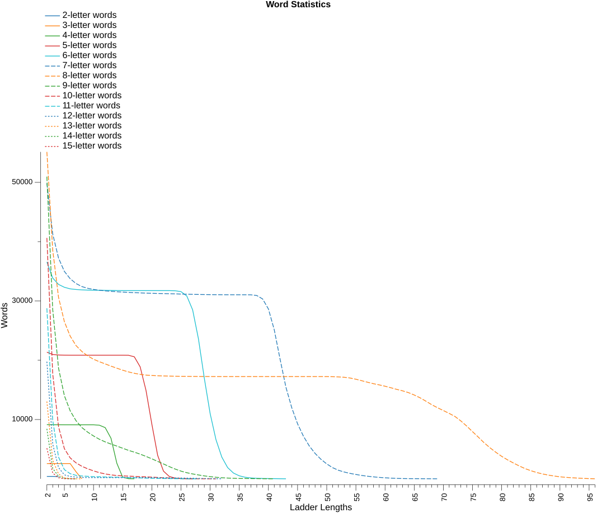
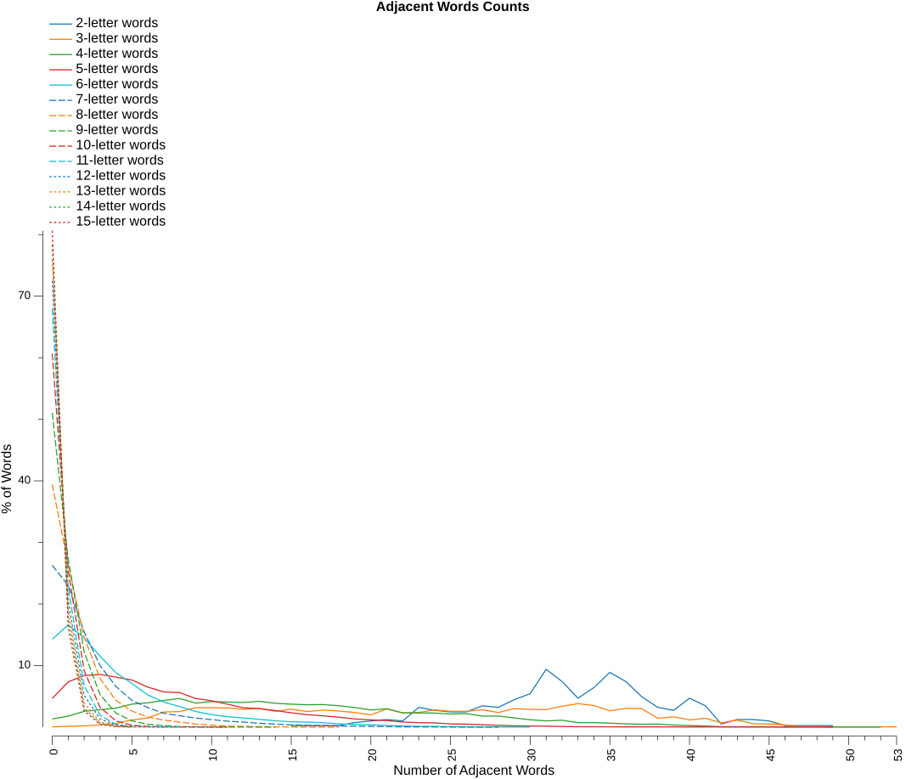

# Analysis Report

### Word Statistics

* Lexicon - based on `enwiktionary`
* Islands - are words that changing any letter will not form another word
* Doublets - are words that changing any letter will only form one other word
* LDS% (local decay smoothness) – the longest consecutive run of ladder lengths for which each word count is at least 95% of the previous ladder length’s count, expressed as a percentage of all ladder lengths in the dictionary
* Var – variance of consecutive count ratios, measuring how smoothly (low) or unevenly (high) word counts decay across ladder lengths
* Drop% – percentage decrease from ladder length 2 to 3, representing initial connectivity decay
* Longest - is the longest possible ladder length for the dictionary
* Numeric columns - are the number of words that can form that ladder length

| Letters | Words | Islands |   %  | Doublets |   %  | LDS% |  Var | Drop% | Longest |     2 |     3 |     4 |     5 |     6 |     7 |     8 |     9 |    10 |    11 |    12 |    13 |    14 |    15 |    16 |    17 |    18 |    19 |    20 |    21 |    22 |    23 |    24 |    25 |    26 |    27 |    28 |    29 |    30 |    31 |    32 |    33 |    34 |    35 |    36 |    37 |    38 |    39 |    40 |    41 |    42 |    43 |    44 |    45 |    46 |    47 |    48 |    49 |    50 |    51 |    52 |    53 |    54 |    55 |    56 |    57 |    58 |    59 |    60 |    61 |    62 |    63 |    64 |    65 |    66 |    67 |    68 |    69 |    70 |    71 |    72 |    73 |    74 |    75 |    76 |    77 |    78 |    79 |    80 |    81 |    82 |    83 |    84 |    85 |    86 |    87 |    88 |    89 |    90 |    91 |    92 |    93 |    94 |    95 |    96 |
|--------:|------:|--------:|-----:|---------:|-----:|-----:|-----:|------:|--------:|------:|------:|------:|------:|------:|------:|------:|------:|------:|------:|------:|------:|------:|------:|------:|------:|------:|------:|------:|------:|------:|------:|------:|------:|------:|------:|------:|------:|------:|------:|------:|------:|------:|------:|------:|------:|------:|------:|------:|------:|------:|------:|------:|------:|------:|------:|------:|------:|------:|------:|------:|------:|------:|------:|------:|------:|------:|------:|------:|------:|------:|------:|------:|------:|------:|------:|------:|------:|------:|------:|------:|------:|------:|------:|------:|------:|------:|------:|------:|------:|------:|------:|------:|------:|------:|------:|------:|------:|------:|------:|------:|------:|------:|------:|------:|
|       2 |   405 |       0 |  0.0 |        0 |  0.0 | 66.7 | 0.00 |   0.0 |       4 |   405 |   405 |   367 |       |       |       |       |       |       |       |       |       |       |       |       |       |       |       |       |       |       |       |       |       |       |       |       |       |       |       |       |       |       |       |       |       |       |       |       |       |       |       |       |       |       |       |       |       |       |       |       |       |       |       |       |       |       |       |       |       |       |       |       |       |       |       |       |       |       |       |       |       |       |       |       |       |       |       |       |       |       |       |       |       |       |       |       |       |       |       |       |       |       |       |       |
|       3 |  2573 |       1 |  0.0 |        0 |  0.0 | 71.4 | 0.15 |   0.0 |       8 |  2572 |  2572 |  2572 |  2572 |  2572 |  1190 |    11 |       |       |       |       |       |       |       |       |       |       |       |       |       |       |       |       |       |       |       |       |       |       |       |       |       |       |       |       |       |       |       |       |       |       |       |       |       |       |       |       |       |       |       |       |       |       |       |       |       |       |       |       |       |       |       |       |       |       |       |       |       |       |       |       |       |       |       |       |       |       |       |       |       |       |       |       |       |       |       |       |       |       |       |       |       |       |       |       |
|       4 |  9264 |     122 |  1.3 |       26 |  0.3 | 68.8 | 0.12 |   0.3 |      17 |  9142 |  9116 |  9112 |  9108 |  9108 |  9108 |  9108 |  9108 |  9108 |  9045 |  8636 |  6833 |  2623 |   274 |    25 |     6 |       |       |       |       |       |       |       |       |       |       |       |       |       |       |       |       |       |       |       |       |       |       |       |       |       |       |       |       |       |       |       |       |       |       |       |       |       |       |       |       |       |       |       |       |       |       |       |       |       |       |       |       |       |       |       |       |       |       |       |       |       |       |       |       |       |       |       |       |       |       |       |       |       |       |       |       |       |       |       |
|       5 | 22403 |    1043 |  4.7 |      388 |  1.7 | 61.5 | 0.09 |   1.8 |      27 | 21360 | 20972 | 20884 | 20857 | 20848 | 20848 | 20848 | 20848 | 20848 | 20848 | 20848 | 20848 | 20848 | 20848 | 20839 | 20576 | 18883 | 14922 |  9239 |  3959 |  1296 |   393 |   116 |    30 |    11 |     4 |       |       |       |       |       |       |       |       |       |       |       |       |       |       |       |       |       |       |       |       |       |       |       |       |       |       |       |       |       |       |       |       |       |       |       |       |       |       |       |       |       |       |       |       |       |       |       |       |       |       |       |       |       |       |       |       |       |       |       |       |       |       |       |       |       |       |       |       |       |
|       6 | 42667 |    6086 | 14.3 |     2714 |  6.4 | 57.1 | 0.04 |   7.4 |      43 | 36581 | 33867 | 32788 | 32306 | 32041 | 31933 | 31865 | 31830 | 31810 | 31797 | 31784 | 31771 | 31755 | 31747 | 31745 | 31745 | 31745 | 31745 | 31745 | 31745 | 31745 | 31744 | 31721 | 31570 | 30832 | 28496 | 23589 | 16980 | 11019 |  6612 |  3673 |  1897 |   975 |   505 |   265 |   145 |    88 |    61 |    44 |    32 |    14 |     5 |       |       |       |       |       |       |       |       |       |       |       |       |       |       |       |       |       |       |       |       |       |       |       |       |       |       |       |       |       |       |       |       |       |       |       |       |       |       |       |       |       |       |       |       |       |       |       |       |       |       |       |       |       |
|       7 | 67616 |   17776 | 26.3 |     8527 | 12.6 | 51.5 | 0.02 |  17.1 |      69 | 49840 | 41313 | 37227 | 34984 | 33743 | 32937 | 32426 | 32135 | 31946 | 31807 | 31700 | 31623 | 31552 | 31492 | 31442 | 31399 | 31359 | 31318 | 31289 | 31261 | 31243 | 31216 | 31191 | 31162 | 31137 | 31111 | 31092 | 31078 | 31063 | 31054 | 31048 | 31044 | 31042 | 31042 | 31042 | 31032 | 30916 | 30337 | 28639 | 25129 | 20167 | 15451 | 11990 |  9270 |  7195 |  5552 |  4288 |  3300 |  2514 |  1884 |  1445 |  1145 |   915 |   731 |   568 |   436 |   332 |   239 |   171 |   113 |    73 |    44 |    31 |    25 |    19 |    13 |     9 |     4 |       |       |       |       |       |       |       |       |       |       |       |       |       |       |       |       |       |       |       |       |       |       |       |       |       |       |       |
|       8 | 91016 |   35879 | 39.4 |    16535 | 18.2 | 69.5 | 0.02 |  30.0 |      96 | 55137 | 38602 | 30614 | 26511 | 24061 | 22473 | 21478 | 20737 | 20168 | 19751 | 19384 | 19002 | 18661 | 18320 | 18032 | 17799 | 17619 | 17494 | 17427 | 17381 | 17351 | 17324 | 17303 | 17290 | 17280 | 17273 | 17263 | 17257 | 17252 | 17247 | 17245 | 17245 | 17245 | 17245 | 17245 | 17245 | 17245 | 17245 | 17245 | 17245 | 17245 | 17245 | 17245 | 17245 | 17245 | 17245 | 17245 | 17245 | 17240 | 17222 | 17188 | 17127 | 17003 | 16796 | 16546 | 16291 | 16046 | 15842 | 15619 | 15361 | 15085 | 14841 | 14544 | 14139 | 13668 | 13102 | 12505 | 11991 | 11516 | 11035 | 10509 |  9763 |  8901 |  7957 |  7029 |  6075 |  5233 |  4481 |  3794 |  3205 |  2677 |  2178 |  1728 |  1374 |  1069 |   821 |   631 |   472 |   340 |   248 |   182 |   123 |    73 |    33 |     8 |
|       9 | 104090 |   53123 | 51.0 |    22374 | 21.5 |  0.0 | 0.02 |  43.9 |      41 | 50967 | 28593 | 18664 | 14025 | 11463 |  9802 |  8648 |  7872 |  7230 |  6672 |  6230 |  5859 |  5522 |  5158 |  4800 |  4497 |  4163 |  3778 |  3377 |  2938 |  2508 |  2056 |  1648 |  1299 |  1029 |   822 |   653 |   494 |   369 |   262 |   180 |   129 |    89 |    61 |    49 |    41 |    31 |    18 |     7 |     3 |       |       |       |       |       |       |       |       |       |       |       |       |       |       |       |       |       |       |       |       |       |       |       |       |       |       |       |       |       |       |       |       |       |       |       |       |       |       |       |       |       |       |       |       |       |       |       |       |       |       |       |       |       |       |       |
|      10 | 103313 |   62684 | 60.7 |    22888 | 22.2 |  0.0 | 0.02 |  56.3 |      31 | 40629 | 17741 |  8788 |  5090 |  3524 |  2693 |  2114 |  1690 |  1341 |  1043 |   825 |   658 |   561 |   499 |   451 |   411 |   367 |   331 |   284 |   232 |   176 |   133 |    93 |    60 |    40 |    20 |     8 |     6 |     4 |     2 |       |       |       |       |       |       |       |       |       |       |       |       |       |       |       |       |       |       |       |       |       |       |       |       |       |       |       |       |       |       |       |       |       |       |       |       |       |       |       |       |       |       |       |       |       |       |       |       |       |       |       |       |       |       |       |       |       |       |       |       |       |       |       |       |       |
|      11 | 89735 |   60975 | 68.0 |    18876 | 21.0 |  0.0 | 0.03 |  65.6 |      28 | 28760 |  9884 |  3670 |  1552 |   866 |   587 |   477 |   417 |   369 |   342 |   312 |   287 |   267 |   242 |   209 |   178 |   145 |   116 |    88 |    63 |    50 |    39 |    25 |    15 |     8 |     5 |     3 |       |       |       |       |       |       |       |       |       |       |       |       |       |       |       |       |       |       |       |       |       |       |       |       |       |       |       |       |       |       |       |       |       |       |       |       |       |       |       |       |       |       |       |       |       |       |       |       |       |       |       |       |       |       |       |       |       |       |       |       |       |       |       |       |       |       |       |       |
|      12 | 71868 |   52107 | 72.5 |    13895 | 19.3 | 45.2 | 0.05 |  70.3 |      32 | 19761 |  5866 |  1894 |   671 |   393 |   285 |   229 |   210 |   202 |   200 |   200 |   200 |   200 |   200 |   200 |   200 |   197 |   193 |   188 |   181 |   173 |   157 |   149 |   136 |   117 |    93 |    72 |    53 |    33 |    20 |     7 |       |       |       |       |       |       |       |       |       |       |       |       |       |       |       |       |       |       |       |       |       |       |       |       |       |       |       |       |       |       |       |       |       |       |       |       |       |       |       |       |       |       |       |       |       |       |       |       |       |       |       |       |       |       |       |       |       |       |       |       |       |       |       |       |
|      13 | 54024 |   40982 | 75.9 |     9899 | 18.3 |  0.0 | 0.00 |  75.9 |       8 | 13042 |  3143 |   813 |   167 |    47 |     8 |     3 |       |       |       |       |       |       |       |       |       |       |       |       |       |       |       |       |       |       |       |       |       |       |       |       |       |       |       |       |       |       |       |       |       |       |       |       |       |       |       |       |       |       |       |       |       |       |       |       |       |       |       |       |       |       |       |       |       |       |       |       |       |       |       |       |       |       |       |       |       |       |       |       |       |       |       |       |       |       |       |       |       |       |       |       |       |       |       |       |
|      14 | 38878 |   30444 | 78.3 |     6664 | 17.1 |  0.0 | 0.00 |  79.0 |       7 |  8434 |  1770 |   412 |    72 |    15 |     3 |       |       |       |       |       |       |       |       |       |       |       |       |       |       |       |       |       |       |       |       |       |       |       |       |       |       |       |       |       |       |       |       |       |       |       |       |       |       |       |       |       |       |       |       |       |       |       |       |       |       |       |       |       |       |       |       |       |       |       |       |       |       |       |       |       |       |       |       |       |       |       |       |       |       |       |       |       |       |       |       |       |       |       |       |       |       |       |       |       |
|      15 | 26709 |   21538 | 80.6 |     4198 | 15.7 |  0.0 | 0.01 |  81.2 |       7 |  5171 |   973 |   182 |    22 |     6 |     2 |       |       |       |       |       |       |       |       |       |       |       |       |       |       |       |       |       |       |       |       |       |       |       |       |       |       |       |       |       |       |       |       |       |       |       |       |       |       |       |       |       |       |       |       |       |       |       |       |       |       |       |       |       |       |       |       |       |       |       |       |       |       |       |       |       |       |       |       |       |       |       |       |       |       |       |       |       |       |       |       |       |       |       |       |       |       |       |       |       |

Observation notes:
1. word - islands = ladder length 2 words
2. word - islands - doublets = ladder length 3 words

### Adjacent Words Counts

This table shows the spread of adjacent word counts for each word in the dictionary.
* Words are considered adjacent if changing just one letter in one word forms the other word.

| Letters |     0 |     1 |     2 |     3 |     4 |     5 |     6 |     7 |     8 |     9 |    10 |    11 |    12 |    13 |    14 |    15 |    16 |    17 |    18 |    19 |    20 |    21 |    22 |    23 |    24 |    25 |    26 |    27 |    28 |    29 |    30 |    31 |    32 |    33 |    34 |    35 |    36 |    37 |    38 |    39 |    40 |    41 |    42 |    43 |    44 |    45 |    46 |    47 |    48 |    49 |    50 |    51 |    52 |    53 |
|--------:|------:|------:|------:|------:|------:|------:|------:|------:|------:|------:|------:|------:|------:|------:|------:|------:|------:|------:|------:|------:|------:|------:|------:|------:|------:|------:|------:|------:|------:|------:|------:|------:|------:|------:|------:|------:|------:|------:|------:|------:|------:|------:|------:|------:|------:|------:|------:|------:|------:|------:|------:|------:|------:|------:|
|       2 |       |       |       |       |       |       |       |       |       |       |       |       |       |       |       |     1 |       |     1 |     1 |     3 |     4 |     5 |     4 |    13 |    11 |    10 |    10 |    14 |    13 |    18 |    22 |    38 |    30 |    19 |    26 |    36 |    30 |    20 |    13 |    11 |    19 |    14 |     2 |     5 |     5 |     4 |     1 |     1 |       |     1 |       |       |       |       |
|       3 |     1 |     3 |     5 |     9 |    15 |    30 |    38 |    63 |    65 |    81 |    81 |    80 |    74 |    78 |    66 |    75 |    65 |    71 |    67 |    61 |    51 |    76 |    59 |    61 |    72 |    66 |    66 |    72 |    61 |    77 |    74 |    73 |    87 |    98 |    90 |    68 |    78 |    77 |    37 |    43 |    30 |    37 |    18 |    29 |    14 |    13 |     9 |     2 |     3 |     1 |     1 |     1 |       |     1 |
|       4 |   122 |   165 |   237 |   261 |   285 |   346 |   365 |   401 |   430 |   361 |   383 |   377 |   370 |   388 |   358 |   345 |   336 |   339 |   321 |   294 |   258 |   275 |   214 |   213 |   211 |   197 |   202 |   166 |   166 |   138 |   110 |    93 |   103 |    67 |    68 |    59 |    49 |    42 |    46 |    31 |    24 |    15 |     6 |     5 |     5 |     5 |     2 |     4 |     4 |     1 |       |       |     1 |       |
|       5 |  1043 |  1644 |  1875 |  1914 |  1819 |  1713 |  1455 |  1281 |  1255 |  1039 |   958 |   834 |   701 |   669 |   603 |   519 |   451 |   409 |   359 |   296 |   262 |   234 |   185 |   159 |   153 |   115 |   107 |    86 |    63 |    44 |    38 |    33 |    22 |    12 |    11 |    10 |     6 |     8 |     7 |       |     4 |     6 |       |       |       |       |       |       |       |     1 |       |       |       |       |
|       6 |  6086 |  7086 |  6185 |  4921 |  3767 |  3022 |  2228 |  1731 |  1424 |  1080 |   860 |   722 |   633 |   540 |   435 |   368 |   349 |   301 |   225 |   190 |   157 |   114 |    82 |    54 |    45 |    27 |    17 |     8 |     6 |     2 |     2 |       |       |       |       |       |       |       |       |       |       |       |       |       |       |       |       |       |       |       |       |       |       |       |
|       7 | 17776 | 15555 | 10465 |  6755 |  4460 |  2930 |  2138 |  1520 |  1242 |   996 |   823 |   647 |   546 |   415 |   333 |   238 |   197 |   169 |   110 |    97 |    73 |    50 |    28 |    21 |    19 |     8 |     1 |     1 |     3 |       |       |       |       |       |       |       |       |       |       |       |       |       |       |       |       |       |       |       |       |       |       |       |       |       |
|       8 | 35879 | 24019 | 13286 |  7178 |  3936 |  2369 |  1468 |  1044 |   737 |   449 |   282 |   155 |   108 |    53 |    30 |    15 |     5 |     2 |     1 |       |       |       |       |       |       |       |       |       |       |       |       |       |       |       |       |       |       |       |       |       |       |       |       |       |       |       |       |       |       |       |       |       |       |       |
|       9 | 53123 | 28442 | 12742 |  5489 |  2373 |  1049 |   476 |   234 |    93 |    43 |    13 |     6 |     5 |     1 |     1 |       |       |       |       |       |       |       |       |       |       |       |       |       |       |       |       |       |       |       |       |       |       |       |       |       |       |       |       |       |       |       |       |       |       |       |       |       |       |       |
|      10 | 62684 | 26344 |  9468 |  3321 |  1018 |   310 |   111 |    43 |     8 |     3 |     2 |     1 |       |       |       |       |       |       |       |       |       |       |       |       |       |       |       |       |       |       |       |       |       |       |       |       |       |       |       |       |       |       |       |       |       |       |       |       |       |       |       |       |       |       |
|      11 | 60975 | 20416 |  6071 |  1728 |   379 |   111 |    42 |     7 |     6 |       |       |       |       |       |       |       |       |       |       |       |       |       |       |       |       |       |       |       |       |       |       |       |       |       |       |       |       |       |       |       |       |       |       |       |       |       |       |       |       |       |       |       |       |       |
|      12 | 52107 | 14780 |  3720 |   947 |   249 |    47 |    16 |     2 |       |       |       |       |       |       |       |       |       |       |       |       |       |       |       |       |       |       |       |       |       |       |       |       |       |       |       |       |       |       |       |       |       |       |       |       |       |       |       |       |       |       |       |       |       |       |
|      13 | 40982 | 10365 |  2107 |   453 |   105 |    10 |     2 |       |       |       |       |       |       |       |       |       |       |       |       |       |       |       |       |       |       |       |       |       |       |       |       |       |       |       |       |       |       |       |       |       |       |       |       |       |       |       |       |       |       |       |       |       |       |       |
|      14 | 30444 |  6918 |  1214 |   240 |    50 |    12 |       |       |       |       |       |       |       |       |       |       |       |       |       |       |       |       |       |       |       |       |       |       |       |       |       |       |       |       |       |       |       |       |       |       |       |       |       |       |       |       |       |       |       |       |       |       |       |       |
|      15 | 21538 |  4327 |   709 |   115 |    18 |     2 |       |       |       |       |       |       |       |       |       |       |       |       |       |       |       |       |       |       |       |       |       |       |       |       |       |       |       |       |       |       |       |       |       |       |       |       |       |       |       |       |       |       |       |       |       |       |       |       |

### Longest Ladders

#### 2-letter words

* _**367**_ words at maximum ladder length _**4**_
* `RF`, `GW`, `DO`, `ET`, `HM`, `XI`, `CE`, `SU`, `OO`, `IN`, `DC`, `PM`, `RX`, `EP`, `FF`, `SN`, `PE`, `BF`, `XO`, `YE`, `CO`, `PC`, `KK`, `XE`, `OT`, `WD`, `WE`, `YU`, `LI`, `MA`, `KT`, `YT`, `HJ`, `SQ`, `BO`, `MU`, `LE`, `PL`, `SK`, `VT`, `WK`, `AB`, `IF`, `AA`, `BU`, `JU`, `HT`, `WC`, `VI`, `OM`, `FT`, `FL`, `CD`, `YW`, `AL`, `RD`, `SC`, `GM`, `FR`, `MH`, `TD`, `DE`, `TA`, `EM`, `WI`, `KI`, `OZ`, `YF`, `MB`, `NI`, `GN`, `TH`, `DN`, `GH`, `GT`, `YP`, `CT`, `HI`, `BY`, `NP`, `VO`, `QV`, `GZ`, `HV`, `QR`, `VY`, `FI`, `KA`, `BN`, `FN`, `MR`, `EQ`, `UH`, `LU`, `YB`, `MO`, `WU`, `PF`, `FW`, `RQ`, `EE`, `HD`, `NU`, `MV`, `IZ`, `HC`, `WZ`, `QY`, `NA`, `DI`, `NG`, `OW`, `NN`, `HW`, `YO`, `HX`, `SE`, `BD`, `HF`, `CH`, `PK`, `WY`, `OC`, `HH`, `TO`, `BA`, `JA`, `EG`, `UT`, `TR`, `MG`, `PA`, `CC`, `HU`, `JB`, `HN`, `XC`, `DA`, `IK`, `EO`, `GE`, `KO`, `IE`, `MN`, `GD`, `TE`, `AH`, `DL`, `EA`, `OE`, `GU`, `GL`, `LN`, `QU`, `SF`, `LX`, `DZ`, `LT`, `HK`, `FY`, `RN`, `VE`, `UV`, `FG`, `TF`, `UC`, `FE`, `AY`, `MC`, `BB`, `BK`, `JW`, `VK`, `HA`, `HO`, `NY`, `LO`, `YY`, `WB`, `DF`, `GO`, `EH`, `ZE`, `BR`, `JR`, `AP`, `YK`, `JO`, `GG`, `XD`, `NV`, `GC`, `OR`, `ZA`, `UG`, `GJ`, `GF`, `VW`, `MT`, `ED`, `NO`, `BM`, `PG`, `LV`, `JK`, `IG`, `TB`, `CZ`, `BE`, `ML`, `SG`, `WO`, `NB`, `TX`, `TT`, `CI`, `YN`, `OV`, `FJ`, `RA`, `PY`, `HR`, `LF`, `FK`, `JY`, `OP`, `YA`, `VV`, `EF`, `KC`, `GP`, `EZ`, `GI`, `BG`, `NM`, `MF`, `AG`, `LL`, `SM`, `DX`, `UZ`, `OG`, `HP`, `TI`, `OD`, `ID`, `TV`, `XU`, `DW`, `QH`, `ON`, `MY`, `MM`, `IO`, `UR`, `EY`, `FD`, `IT`, `RE`, `LA`, `BT`, `QI`, `FX`, `RM`, `FA`, `SI`, `ND`, `UL`, `MP`, `BJ`, `WT`, `HB`, `OF`, `PI`, `EX`, `ST`, `IM`, `PH`, `QC`, `BX`, `UP`, `OB`, `OK`, `EW`, `MI`, `BC`, `YR`, `WA`, `PO`, `FM`, `QT`, `WF`, `LC`, `DK`, `PX`, `TM`, `UM`, `SP`, `OX`, `SD`, `BP`, `TP`, `EN`, `TL`, `RT`, `TK`, `VP`, `AC`, `FU`, `SH`, `AK`, `MK`, `UN`, `PR`, `DR`, `WW`, `WP`, `PB`, `PP`, `NT`, `YH`, `ER`, `ZO`, `OI`, `EL`, `FO`, `GX`, `BI`, `AV`, `SB`, `YD`, `TN`, `RP`, `CF`, `AZ`, `RB`, `LP`, `HE`, `ME`, `CA`, `TY`, `OY`, `PT`, `VB`, `LY`, `OL`, `DY`, `AQ`, `LG`, `KB`, `PW`, `FB`, `CP`, `OH`, `GR`, `CG`, `NE`, `TU`, `BW`, `SO`, `RI`, `NR`, `KY`, `OU`, `LB`, `DD`, `CR`

#### 3-letter words

* _**11**_ words at maximum ladder length _**8**_
* `WMK`, `QOF`, `WQO`, `XXX`, `ZUZ`, `LPF`, `MCF`, `ZZZ`, `LBF`, `CNX`, `IBR`

#### 4-letter words

* _**6**_ words at maximum ladder length _**17**_
* `ETUX`, `WLHI`, `ENUF`, `OVUM`, `TSHK`, `ODUM`

#### 5-letter words

* _**4**_ words at maximum ladder length _**27**_
* `ENEMY`, `ILIUM`, `ENGMA`, `ILEUS`

#### 6-letter words

* _**5**_ words at maximum ladder length _**43**_
* `LOTFUL`, `DUEFUL`, `IMBOSK`, `HUEMUL`, `RUEFUL`

#### 7-letter words

* _**4**_ words at maximum ladder length _**69**_
* `ABILISM`, `UNISIZE`, `OUTPLAN`, `ANIMIST`

#### 8-letter words

* _**8**_ words at maximum ladder length _**96**_
* `SOLATIUM`, `CLIONIDS`, `CHRONICK`, `BUCKETER`, `FULLAGES`, `HOPSAGES`, `PILLARET`, `PARASHAH`

#### 9-letter words

* _**3**_ words at maximum ladder length _**41**_
* `PUNCHLESS`, `BLUTCHERS`, `LUNCHLESS`

#### 10-letter words

* _**2**_ words at maximum ladder length _**31**_
* `BEDHOPPING`, `REBRAIDING`

#### 11-letter words

* _**3**_ words at maximum ladder length _**28**_
* `RENTABILITY`, `BISTABILITY`, `TESTABILITY`

#### 12-letter words

* _**7**_ words at maximum ladder length _**32**_
* `VICELESSNESS`, `LOVELESSNESS`, `DATALESSNESS`, `MANELESSNESS`, `TACTLESSNESS`, `VOTELESSNESS`, `MALELESSNESS`

#### 13-letter words

* _**3**_ words at maximum ladder length _**8**_
* `NEGROFICATION`, `PEERIFICATION`, `METRIFICATION`

#### 14-letter words

* _**3**_ words at maximum ladder length _**7**_
* `DEHYDROGENIZED`, `REHYDROGENATED`, `DIHYDROGENATED`

#### 15-letter words

* _**2**_ words at maximum ladder length _**7**_
* `DEUBIQUITINASES`, `DEUBIQUITYLASES`

