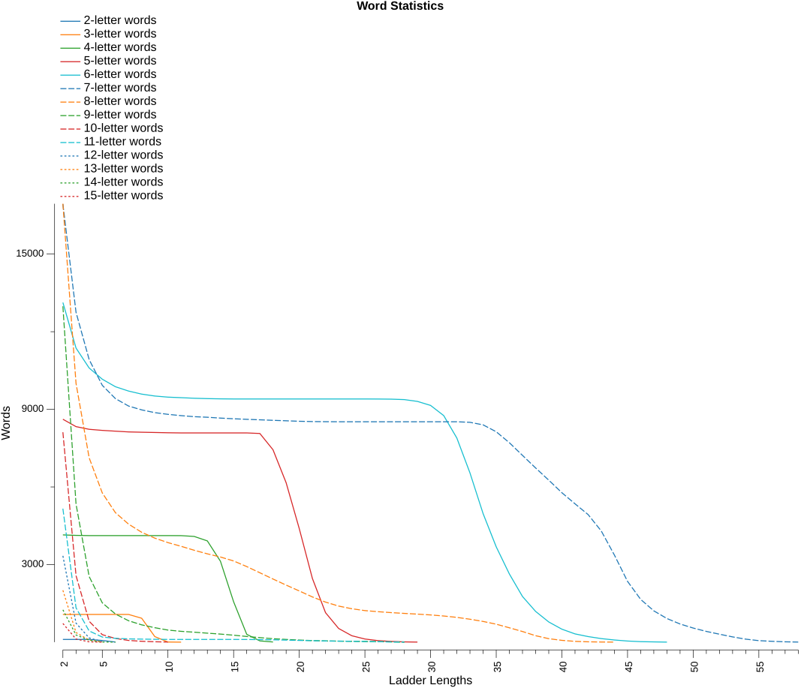
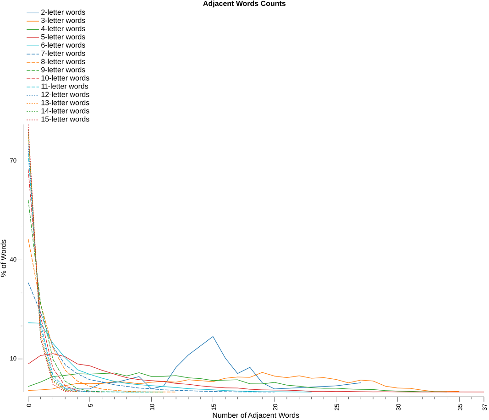

# Analysis Report

### Word Statistics

* Lexicon - based on NSWL23
* Islands - are words that changing any letter will not form another word
* Doublets - are words that changing any letter will only form one other word
* LDS% (local decay smoothness) – the longest consecutive run of ladder lengths for which each word count is at least 95% of the previous ladder length’s count, expressed as a percentage of all ladder lengths in the dictionary
* Var – variance of consecutive count ratios, measuring how smoothly (low) or unevenly (high) word counts decay across ladder lengths
* Drop% – percentage decrease from ladder length 2 to 3, representing initial connectivity decay
* Longest - is the longest possible ladder length for the dictionary
* Numeric columns - are the number of words that can form that ladder length

| Letters | Words | Islands |   %  | Doublets |   %  | LDS% |  Var | Drop% | Longest |     2 |     3 |     4 |     5 |     6 |     7 |     8 |     9 |    10 |    11 |    12 |    13 |    14 |    15 |    16 |    17 |    18 |    19 |    20 |    21 |    22 |    23 |    24 |    25 |    26 |    27 |    28 |    29 |    30 |    31 |    32 |    33 |    34 |    35 |    36 |    37 |    38 |    39 |    40 |    41 |    42 |    43 |    44 |    45 |    46 |    47 |    48 |    49 |    50 |    51 |    52 |    53 |    54 |    55 |    56 |    57 |    58 |
|--------:|------:|--------:|-----:|---------:|-----:|-----:|-----:|------:|--------:|------:|------:|------:|------:|------:|------:|------:|------:|------:|------:|------:|------:|------:|------:|------:|------:|------:|------:|------:|------:|------:|------:|------:|------:|------:|------:|------:|------:|------:|------:|------:|------:|------:|------:|------:|------:|------:|------:|------:|------:|------:|------:|------:|------:|------:|------:|------:|------:|------:|------:|------:|------:|------:|------:|------:|------:|------:|
|       2 |   107 |       0 |  0.0 |        0 |  0.0 | 60.0 | 0.14 |   0.0 |       6 |   107 |   107 |   107 |    67 |     6 |       |       |       |       |       |       |       |       |       |       |       |       |       |       |       |       |       |       |       |       |       |       |       |       |       |       |       |       |       |       |       |       |       |       |       |       |       |       |       |       |       |       |       |       |       |       |       |       |       |       |       |       |
|       3 |  1078 |       5 |  0.5 |        0 |  0.0 | 60.0 | 0.15 |   0.0 |      11 |  1073 |  1073 |  1073 |  1073 |  1073 |  1073 |   926 |   216 |     7 |     2 |       |       |       |       |       |       |       |       |       |       |       |       |       |       |       |       |       |       |       |       |       |       |       |       |       |       |       |       |       |       |       |       |       |       |       |       |       |       |       |       |       |       |       |       |       |       |       |
|       4 |  4218 |      71 |  1.7 |       19 |  0.5 | 70.6 | 0.11 |   0.5 |      18 |  4147 |  4128 |  4120 |  4120 |  4120 |  4120 |  4120 |  4120 |  4120 |  4118 |  4087 |  3915 |  3127 |  1563 |   305 |    50 |     8 |       |       |       |       |       |       |       |       |       |       |       |       |       |       |       |       |       |       |       |       |       |       |       |       |       |       |       |       |       |       |       |       |       |       |       |       |       |       |       |       |
|       5 |  9418 |     801 |  8.5 |      286 |  3.0 | 57.1 | 0.06 |   3.3 |      29 |  8617 |  8331 |  8228 |  8186 |  8156 |  8127 |  8115 |  8105 |  8094 |  8088 |  8088 |  8088 |  8088 |  8088 |  8088 |  8066 |  7438 |  6163 |  4390 |  2464 |  1142 |   530 |   250 |   123 |    61 |    31 |    12 |     4 |       |       |       |       |       |       |       |       |       |       |       |       |       |       |       |       |       |       |       |       |       |       |       |       |       |       |       |       |       |
|       6 | 16614 |    3486 | 21.0 |     1761 | 10.6 | 59.6 | 0.03 |  13.4 |      48 | 13128 | 11367 | 10597 | 10164 |  9874 |  9706 |  9588 |  9514 |  9471 |  9450 |  9428 |  9414 |  9405 |  9400 |  9400 |  9400 |  9400 |  9400 |  9400 |  9400 |  9400 |  9400 |  9400 |  9400 |  9398 |  9393 |  9376 |  9306 |  9151 |  8759 |  7891 |  6543 |  4970 |  3686 |  2638 |  1767 |  1190 |   782 |   503 |   321 |   217 |   139 |    85 |    45 |    21 |    12 |     3 |       |       |       |       |       |       |       |       |       |       |
|       7 | 25331 |    8397 | 33.1 |     4185 | 16.5 | 52.6 | 0.03 |  24.7 |      58 | 16934 | 12749 | 10923 |  9928 |  9415 |  9127 |  8978 |  8872 |  8806 |  8756 |  8716 |  8694 |  8661 |  8635 |  8614 |  8595 |  8575 |  8557 |  8538 |  8527 |  8522 |  8519 |  8519 |  8519 |  8519 |  8519 |  8519 |  8519 |  8519 |  8519 |  8519 |  8498 |  8400 |  8133 |  7710 |  7220 |  6734 |  6263 |  5777 |  5349 |  4931 |  4298 |  3367 |  2351 |  1654 |  1212 |   915 |   704 |   547 |   417 |   309 |   205 |   118 |    60 |    34 |    15 |     5 |
|       8 | 31586 |   14640 | 46.3 |     6944 | 22.0 | 16.3 | 0.03 |  41.0 |      44 | 16946 | 10002 |  7126 |  5768 |  5006 |  4564 |  4248 |  4022 |  3849 |  3706 |  3553 |  3415 |  3292 |  3140 |  2923 |  2683 |  2442 |  2207 |  1981 |  1749 |  1550 |  1396 |  1293 |  1221 |  1179 |  1143 |  1113 |  1085 |  1054 |  1012 |   959 |   888 |   802 |   696 |   557 |   413 |   251 |   136 |    71 |    32 |    15 |     7 |     3 |       |       |       |       |       |       |       |       |       |       |       |       |       |       |
|       9 | 31089 |   18106 | 58.2 |     7645 | 24.6 |  0.0 | 0.02 |  58.9 |      28 | 12983 |  5338 |  2538 |  1521 |  1090 |   829 |   670 |   560 |   469 |   420 |   387 |   349 |   313 |   271 |   221 |   177 |   135 |   107 |    82 |    63 |    48 |    41 |    35 |    27 |    20 |    11 |     3 |       |       |       |       |       |       |       |       |       |       |       |       |       |       |       |       |       |       |       |       |       |       |       |       |       |       |       |       |       |       |
|      10 | 24937 |   16822 | 67.5 |     5542 | 22.2 |  0.0 | 0.01 |  68.3 |      10 |  8115 |  2573 |   809 |   291 |   144 |    68 |    35 |    17 |     6 |       |       |       |       |       |       |       |       |       |       |       |       |       |       |       |       |       |       |       |       |       |       |       |       |       |       |       |       |       |       |       |       |       |       |       |       |       |       |       |       |       |       |       |       |       |       |       |       |
|      11 | 18666 |   13504 | 72.3 |     3833 | 20.5 | 29.6 | 0.05 |  74.3 |      28 |  5162 |  1329 |   435 |   199 |   149 |   128 |   119 |   112 |   107 |   107 |   107 |   107 |   107 |   107 |   105 |    99 |    92 |    81 |    69 |    59 |    48 |    41 |    35 |    27 |    20 |    11 |     3 |       |       |       |       |       |       |       |       |       |       |       |       |       |       |       |       |       |       |       |       |       |       |       |       |       |       |       |       |       |       |
|      12 | 13469 |   10131 | 75.2 |     2601 | 19.3 |  0.0 | 0.00 |  77.9 |       5 |  3338 |   737 |   166 |    19 |       |       |       |       |       |       |       |       |       |       |       |       |       |       |       |       |       |       |       |       |       |       |       |       |       |       |       |       |       |       |       |       |       |       |       |       |       |       |       |       |       |       |       |       |       |       |       |       |       |       |       |       |       |
|      13 |  9304 |    7297 | 78.4 |     1634 | 17.6 |  0.0 | 0.00 |  81.4 |       5 |  2007 |   373 |    84 |     8 |       |       |       |       |       |       |       |       |       |       |       |       |       |       |       |       |       |       |       |       |       |       |       |       |       |       |       |       |       |       |       |       |       |       |       |       |       |       |       |       |       |       |       |       |       |       |       |       |       |       |       |       |       |
|      14 |  6095 |    4843 | 79.5 |      973 | 16.0 |  0.0 | 0.02 |  77.7 |       6 |  1252 |   279 |    77 |     6 |     3 |       |       |       |       |       |       |       |       |       |       |       |       |       |       |       |       |       |       |       |       |       |       |       |       |       |       |       |       |       |       |       |       |       |       |       |       |       |       |       |       |       |       |       |       |       |       |       |       |       |       |       |       |
|      15 |  3835 |    3110 | 81.1 |      604 | 15.7 |  0.0 | 0.00 |  83.3 |       5 |   725 |   121 |    14 |     2 |       |       |       |       |       |       |       |       |       |       |       |       |       |       |       |       |       |       |       |       |       |       |       |       |       |       |       |       |       |       |       |       |       |       |       |       |       |       |       |       |       |       |       |       |       |       |       |       |       |       |       |       |       |

Observation notes:
1. word - islands = ladder length 2 words
2. word - islands - doublets = ladder length 3 words

### Adjacent Words Counts

This table shows the spread of adjacent word counts for each word in the dictionary.
* Words are considered adjacent if changing just one letter in one word forms the other word.

| Letters |     0 |     1 |     2 |     3 |     4 |     5 |     6 |     7 |     8 |     9 |    10 |    11 |    12 |    13 |    14 |    15 |    16 |    17 |    18 |    19 |    20 |    21 |    22 |    23 |    24 |    25 |    26 |    27 |    28 |    29 |    30 |    31 |    32 |    33 |    34 |    35 |    36 |    37 |
|--------:|------:|------:|------:|------:|------:|------:|------:|------:|------:|------:|------:|------:|------:|------:|------:|------:|------:|------:|------:|------:|------:|------:|------:|------:|------:|------:|------:|------:|------:|------:|------:|------:|------:|------:|------:|------:|------:|------:|
|       2 |       |       |       |     1 |       |     1 |     3 |     3 |     4 |     5 |     1 |     2 |     8 |    12 |    15 |    18 |    11 |     6 |     8 |     3 |     1 |       |       |       |       |     2 |       |     3 |       |       |       |       |       |       |       |       |       |       |
|       3 |     5 |     7 |    10 |    21 |    28 |    27 |    28 |    34 |    32 |    27 |    32 |    35 |    32 |    40 |    37 |    34 |    45 |    49 |    48 |    64 |    52 |    47 |    53 |    45 |    47 |    41 |    30 |    39 |    36 |    19 |    13 |    12 |     6 |     1 |       |     2 |       |       |
|       4 |    71 |   127 |   198 |   213 |   233 |   229 |   236 |   243 |   205 |   247 |   199 |   201 |   209 |   182 |   171 |   147 |   152 |   156 |   105 |   104 |   123 |    88 |    74 |    55 |    48 |    49 |    39 |    34 |    32 |    18 |    12 |     9 |     3 |     4 |     2 |       |       |       |
|       5 |   801 |  1042 |  1095 |  1008 |   801 |   748 |   619 |   511 |   409 |   353 |   325 |   300 |   246 |   220 |   175 |   144 |   119 |   114 |    79 |    62 |    56 |    53 |    39 |    20 |    21 |    14 |    17 |     8 |     4 |     6 |     3 |     2 |     1 |     2 |       |       |       |     1 |
|       6 |  3486 |  3463 |  2457 |  1729 |  1121 |   890 |   696 |   537 |   434 |   369 |   321 |   274 |   229 |   167 |   142 |   112 |    72 |    50 |    32 |    13 |    12 |     7 |       |     1 |       |       |       |       |       |       |       |       |       |       |       |       |       |       |
|       7 |  8397 |  6121 |  3505 |  2094 |  1395 |   943 |   779 |   554 |   433 |   305 |   246 |   165 |   134 |   102 |    65 |    48 |    25 |    10 |     9 |       |     1 |       |       |       |       |       |       |       |       |       |       |       |       |       |       |       |       |       |
|       8 | 14640 |  8453 |  4236 |  2091 |  1048 |   555 |   279 |   173 |    71 |    28 |    11 |       |     1 |       |       |       |       |       |       |       |       |       |       |       |       |       |       |       |       |       |       |       |       |       |       |       |       |       |
|       9 | 18106 |  8407 |  3096 |  1023 |   312 |    91 |    29 |    17 |     5 |     1 |     1 |     1 |       |       |       |       |       |       |       |       |       |       |       |       |       |       |       |       |       |       |       |       |       |       |       |       |       |       |
|      10 | 16822 |  5722 |  1814 |   455 |   103 |    19 |     2 |       |       |       |       |       |       |       |       |       |       |       |       |       |       |       |       |       |       |       |       |       |       |       |       |       |       |       |       |       |       |       |
|      11 | 13504 |  3882 |   955 |   223 |    72 |    16 |     5 |     7 |     1 |       |     1 |       |       |       |       |       |       |       |       |       |       |       |       |       |       |       |       |       |       |       |       |       |       |       |       |       |       |       |
|      12 | 10131 |  2626 |   580 |   110 |    20 |     2 |       |       |       |       |       |       |       |       |       |       |       |       |       |       |       |       |       |       |       |       |       |       |       |       |       |       |       |       |       |       |       |       |
|      13 |  7297 |  1650 |   293 |    54 |    10 |       |       |       |       |       |       |       |       |       |       |       |       |       |       |       |       |       |       |       |       |       |       |       |       |       |       |       |       |       |       |       |       |       |
|      14 |  4843 |   990 |   222 |    26 |    14 |       |       |       |       |       |       |       |       |       |       |       |       |       |       |       |       |       |       |       |       |       |       |       |       |       |       |       |       |       |       |       |       |       |
|      15 |  3110 |   628 |    89 |     6 |     2 |       |       |       |       |       |       |       |       |       |       |       |       |       |       |       |       |       |       |       |       |       |       |       |       |       |       |       |       |       |       |       |       |       |

### Longest Ladders

#### 2-letter words

* _**6**_ words at maximum ladder length _**6**_
* `ID`, `IF`, `IN`, `IS`, `IT`, `JO`

#### 3-letter words

* _**2**_ words at maximum ladder length _**11**_
* `IVY`, `ZZZ`

#### 4-letter words

* _**8**_ words at maximum ladder length _**18**_
* `ATAP`, `ATOM`, `INCH`, `OXID`, `OXIM`, `QUEY`, `UNAU`, `YEOW`

#### 5-letter words

* _**4**_ words at maximum ladder length _**29**_
* `APTLY`, `ASCUS`, `GENRO`, `ILLER`

#### 6-letter words

* _**3**_ words at maximum ladder length _**48**_
* `BASSLY`, `BROOCH`, `WREATH`

#### 7-letter words

* _**5**_ words at maximum ladder length _**58**_
* `DEFUZED`, `ENROBER`, `ENROBES`, `UNHOPED`, `UNROPES`

#### 8-letter words

* _**3**_ words at maximum ladder length _**44**_
* `COURSING`, `HOPPLING`, `POPPLING`

#### 9-letter words

* _**3**_ words at maximum ladder length _**28**_
* `DODGINESS`, `NERVINESS`, `PODGINESS`

#### 10-letter words

* _**6**_ words at maximum ladder length _**10**_
* `BLISTERING`, `GLISTENING`, `SCUTTERING`, `SPUTTERING`, `STUTTERING`, `SWITHERING`

#### 11-letter words

* _**3**_ words at maximum ladder length _**28**_
* `DODGINESSES`, `NERVINESSES`, `PODGINESSES`

#### 12-letter words

* _**19**_ words at maximum ladder length _**5**_
* `BASIFICATION`, `CROAKINESSES`, `DREARINESSES`, `FLOPPINESSES`, `FREAKINESSES`, `NATIONALISMS`, `NATIONALISTS`, `NATIONALIZED`, `NATIONALIZER`, `NOSOGRAPHIES`, `PHAGOCYTIZED`, `PHAGOCYTOSIS`, `RATIFICATION`, `RATIONALISMS`, `RATIONALISTS`, `RATIONALIZED`, `RATIONALIZER`, `SNAPPINESSES`, `TYPOGRAPHIES`

#### 13-letter words

* _**8**_ words at maximum ladder length _**5**_
* `BASIFICATIONS`, `DECENTRALISTS`, `DEVOLUTIONISM`, `EXPANDABILITY`, `EXTENSIBILITY`, `RATIFICATIONS`, `RECENTRALIZED`, `REVOLUTIONIZE`

#### 14-letter words

* _**3**_ words at maximum ladder length _**6**_
* `DEVOLUTIONISMS`, `REVOLUTIONIZED`, `REVOLUTIONIZER`

#### 15-letter words

* _**2**_ words at maximum ladder length _**5**_
* `EXPANDABILITIES`, `EXTENSIBILITIES`

