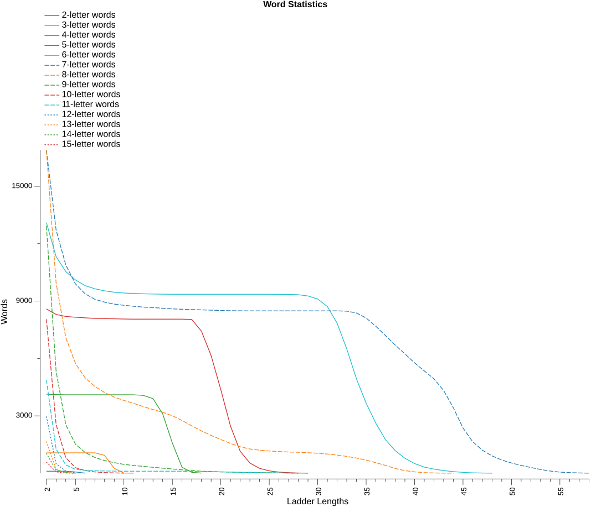
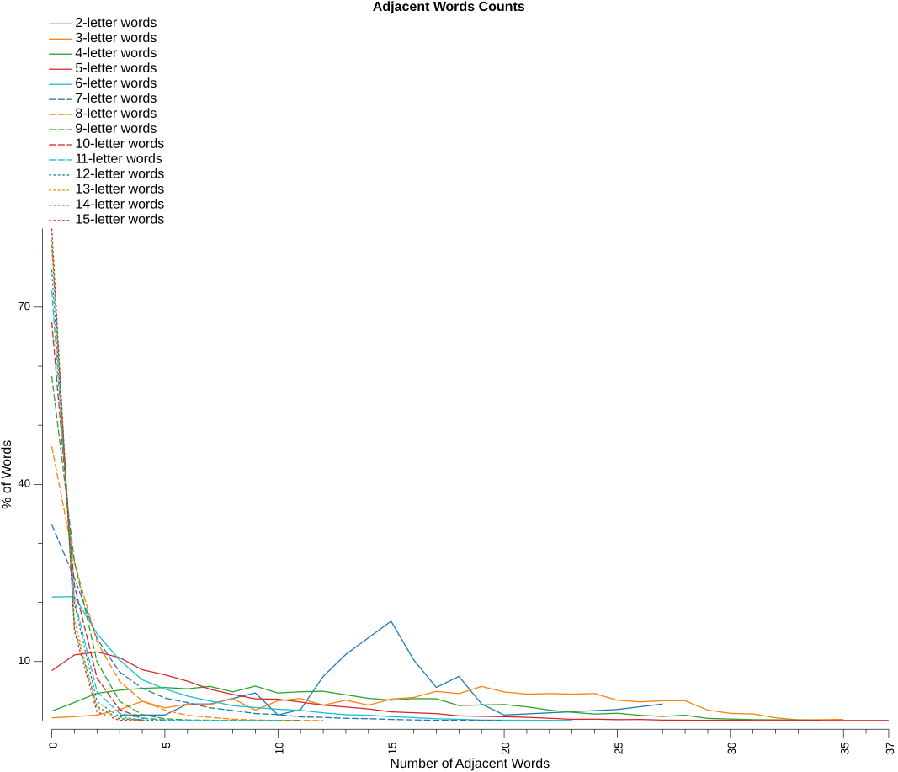

# Analysis Report

### Word Statistics

* Lexicon - based on NWL20
* Islands - are words that changing any letter will not form another word
* Doublets - are words that changing any letter will only form one other word
* LDS% (local decay smoothness) – the longest consecutive run of ladder lengths for which each word count is at least 95% of the previous ladder length’s count, expressed as a percentage of all ladder lengths in the dictionary
* Var – variance of consecutive count ratios, measuring how smoothly (low) or unevenly (high) word counts decay across ladder lengths
* Drop% – percentage decrease from ladder length 2 to 3, representing initial connectivity decay
* Longest - is the longest possible ladder length for the dictionary
* Numeric columns - are the number of words that can form that ladder length

| Letters | Words | Islands |   %  | Doublets |   %  | LDS% |  Var | Drop% | Longest |     2 |     3 |     4 |     5 |     6 |     7 |     8 |     9 |    10 |    11 |    12 |    13 |    14 |    15 |    16 |    17 |    18 |    19 |    20 |    21 |    22 |    23 |    24 |    25 |    26 |    27 |    28 |    29 |    30 |    31 |    32 |    33 |    34 |    35 |    36 |    37 |    38 |    39 |    40 |    41 |    42 |    43 |    44 |    45 |    46 |    47 |    48 |    49 |    50 |    51 |    52 |    53 |    54 |    55 |    56 |    57 |    58 |
|--------:|------:|--------:|-----:|---------:|-----:|-----:|-----:|------:|--------:|------:|------:|------:|------:|------:|------:|------:|------:|------:|------:|------:|------:|------:|------:|------:|------:|------:|------:|------:|------:|------:|------:|------:|------:|------:|------:|------:|------:|------:|------:|------:|------:|------:|------:|------:|------:|------:|------:|------:|------:|------:|------:|------:|------:|------:|------:|------:|------:|------:|------:|------:|------:|------:|------:|------:|------:|------:|
|       2 |   107 |       0 |  0.0 |        0 |  0.0 | 60.0 | 0.14 |   0.0 |       6 |   107 |   107 |   107 |    67 |     6 |       |       |       |       |       |       |       |       |       |       |       |       |       |       |       |       |       |       |       |       |       |       |       |       |       |       |       |       |       |       |       |       |       |       |       |       |       |       |       |       |       |       |       |       |       |       |       |       |       |       |       |       |
|       3 |  1073 |       5 |  0.5 |        0 |  0.0 | 60.0 | 0.15 |   0.0 |      11 |  1068 |  1068 |  1068 |  1068 |  1068 |  1068 |   936 |   257 |    10 |     2 |       |       |       |       |       |       |       |       |       |       |       |       |       |       |       |       |       |       |       |       |       |       |       |       |       |       |       |       |       |       |       |       |       |       |       |       |       |       |       |       |       |       |       |       |       |       |       |
|       4 |  4201 |      67 |  1.6 |       23 |  0.5 | 70.6 | 0.11 |   0.6 |      18 |  4134 |  4111 |  4103 |  4103 |  4103 |  4103 |  4103 |  4103 |  4103 |  4101 |  4070 |  3901 |  3106 |  1578 |   312 |    49 |     8 |       |       |       |       |       |       |       |       |       |       |       |       |       |       |       |       |       |       |       |       |       |       |       |       |       |       |       |       |       |       |       |       |       |       |       |       |       |       |       |       |
|       5 |  9383 |     794 |  8.5 |      287 |  3.1 | 57.1 | 0.06 |   3.3 |      29 |  8589 |  8302 |  8196 |  8154 |  8124 |  8095 |  8083 |  8073 |  8062 |  8056 |  8056 |  8056 |  8056 |  8056 |  8056 |  8040 |  7426 |  6150 |  4371 |  2466 |  1149 |   536 |   254 |   125 |    60 |    31 |    12 |     4 |       |       |       |       |       |       |       |       |       |       |       |       |       |       |       |       |       |       |       |       |       |       |       |       |       |       |       |       |       |
|       6 | 16569 |    3466 | 20.9 |     1778 | 10.7 | 59.6 | 0.03 |  13.6 |      48 | 13103 | 11325 | 10544 | 10105 |  9806 |  9643 |  9534 |  9464 |  9421 |  9401 |  9380 |  9368 |  9361 |  9356 |  9356 |  9356 |  9356 |  9356 |  9356 |  9356 |  9356 |  9356 |  9356 |  9356 |  9354 |  9349 |  9333 |  9267 |  9109 |  8715 |  7849 |  6503 |  4935 |  3665 |  2618 |  1750 |  1183 |   784 |   505 |   321 |   217 |   139 |    85 |    45 |    21 |    12 |     3 |       |       |       |       |       |       |       |       |       |       |
|       7 | 25269 |    8380 | 33.2 |     4173 | 16.5 | 52.6 | 0.03 |  24.7 |      58 | 16889 | 12716 | 10889 |  9897 |  9378 |  9094 |  8945 |  8843 |  8779 |  8728 |  8686 |  8661 |  8626 |  8593 |  8573 |  8558 |  8541 |  8525 |  8508 |  8497 |  8492 |  8489 |  8489 |  8489 |  8489 |  8489 |  8489 |  8489 |  8489 |  8489 |  8489 |  8472 |  8378 |  8117 |  7683 |  7194 |  6702 |  6242 |  5771 |  5350 |  4937 |  4327 |  3425 |  2364 |  1648 |  1204 |   905 |   692 |   537 |   408 |   300 |   198 |   116 |    58 |    34 |    15 |     5 |
|       8 | 31523 |   14632 | 46.4 |     6937 | 22.0 | 18.6 | 0.03 |  41.1 |      44 | 16891 |  9954 |  7090 |  5740 |  4984 |  4539 |  4218 |  3982 |  3805 |  3652 |  3484 |  3329 |  3188 |  3006 |  2757 |  2476 |  2212 |  1978 |  1763 |  1558 |  1382 |  1270 |  1205 |  1164 |  1133 |  1110 |  1094 |  1073 |  1044 |  1004 |   951 |   881 |   794 |   687 |   550 |   410 |   251 |   136 |    71 |    32 |    15 |     7 |     3 |       |       |       |       |       |       |       |       |       |       |       |       |       |       |
|       9 | 31002 |   18075 | 58.3 |     7596 | 24.5 |  0.0 | 0.02 |  58.8 |      28 | 12927 |  5331 |  2539 |  1518 |  1084 |   824 |   664 |   554 |   463 |   405 |   359 |   311 |   266 |   222 |   176 |   141 |   108 |    88 |    71 |    59 |    48 |    41 |    35 |    27 |    20 |    11 |     3 |       |       |       |       |       |       |       |       |       |       |       |       |       |       |       |       |       |       |       |       |       |       |       |       |       |       |       |       |       |       |
|      10 | 24786 |   16735 | 67.5 |     5501 | 22.2 |  0.0 | 0.01 |  68.3 |      10 |  8051 |  2550 |   811 |   287 |   142 |    68 |    35 |    17 |     6 |       |       |       |       |       |       |       |       |       |       |       |       |       |       |       |       |       |       |       |       |       |       |       |       |       |       |       |       |       |       |       |       |       |       |       |       |       |       |       |       |       |       |       |       |       |       |       |       |
|      11 | 17919 |   13043 | 72.8 |     3613 | 20.2 | 29.6 | 0.05 |  74.1 |      28 |  4876 |  1263 |   436 |   200 |   149 |   128 |   119 |   112 |   107 |   107 |   107 |   107 |   107 |   107 |   105 |    99 |    92 |    81 |    69 |    59 |    48 |    41 |    35 |    27 |    20 |    11 |     3 |       |       |       |       |       |       |       |       |       |       |       |       |       |       |       |       |       |       |       |       |       |       |       |       |       |       |       |       |       |       |
|      12 | 12506 |    9539 | 76.3 |     2471 | 19.8 |  0.0 | 0.00 |  83.3 |       5 |  2967 |   496 |   116 |    17 |       |       |       |       |       |       |       |       |       |       |       |       |       |       |       |       |       |       |       |       |       |       |       |       |       |       |       |       |       |       |       |       |       |       |       |       |       |       |       |       |       |       |       |       |       |       |       |       |       |       |       |       |       |
|      13 |  8466 |    6808 | 80.4 |     1450 | 17.1 |  0.0 | 0.00 |  87.5 |       5 |  1658 |   208 |    37 |     4 |       |       |       |       |       |       |       |       |       |       |       |       |       |       |       |       |       |       |       |       |       |       |       |       |       |       |       |       |       |       |       |       |       |       |       |       |       |       |       |       |       |       |       |       |       |       |       |       |       |       |       |       |       |
|      14 |  5556 |    4520 | 81.4 |      869 | 15.6 |  0.0 | 0.00 |  83.9 |       5 |  1036 |   167 |    38 |     3 |       |       |       |       |       |       |       |       |       |       |       |       |       |       |       |       |       |       |       |       |       |       |       |       |       |       |       |       |       |       |       |       |       |       |       |       |       |       |       |       |       |       |       |       |       |       |       |       |       |       |       |       |       |
|      15 |  3492 |    2909 | 83.3 |      513 | 14.7 |  0.0 | 0.00 |  88.0 |       5 |   583 |    70 |    12 |     2 |       |       |       |       |       |       |       |       |       |       |       |       |       |       |       |       |       |       |       |       |       |       |       |       |       |       |       |       |       |       |       |       |       |       |       |       |       |       |       |       |       |       |       |       |       |       |       |       |       |       |       |       |       |

Observation notes:
1. word - islands = ladder length 2 words
2. word - islands - doublets = ladder length 3 words

### Adjacent Words Counts

This table shows the spread of adjacent word counts for each word in the dictionary.
* Words are considered adjacent if changing just one letter in one word forms the other word.

| Letters |     0 |     1 |     2 |     3 |     4 |     5 |     6 |     7 |     8 |     9 |    10 |    11 |    12 |    13 |    14 |    15 |    16 |    17 |    18 |    19 |    20 |    21 |    22 |    23 |    24 |    25 |    26 |    27 |    28 |    29 |    30 |    31 |    32 |    33 |    34 |    35 |    36 |    37 |
|--------:|------:|------:|------:|------:|------:|------:|------:|------:|------:|------:|------:|------:|------:|------:|------:|------:|------:|------:|------:|------:|------:|------:|------:|------:|------:|------:|------:|------:|------:|------:|------:|------:|------:|------:|------:|------:|------:|------:|
|       2 |       |       |       |     1 |       |     1 |     3 |     3 |     4 |     5 |     1 |     2 |     8 |    12 |    15 |    18 |    11 |     6 |     8 |     3 |     1 |       |       |       |       |     2 |       |     3 |       |       |       |       |       |       |       |       |       |       |
|       3 |     5 |     7 |    10 |    20 |    35 |    23 |    30 |    29 |    40 |    19 |    36 |    40 |    28 |    37 |    28 |    39 |    42 |    53 |    49 |    62 |    52 |    48 |    49 |    48 |    49 |    37 |    34 |    36 |    36 |    19 |    13 |    12 |     5 |     1 |       |     2 |       |       |
|       4 |    67 |   129 |   194 |   216 |   229 |   235 |   226 |   243 |   204 |   245 |   196 |   205 |   208 |   183 |   158 |   145 |   156 |   155 |   107 |   111 |   114 |    98 |    74 |    59 |    46 |    52 |    37 |    29 |    38 |    15 |    11 |     6 |     5 |     4 |     1 |       |       |       |
|       5 |   794 |  1043 |  1091 |  1000 |   808 |   727 |   626 |   497 |   415 |   345 |   339 |   294 |   245 |   216 |   184 |   138 |   124 |   110 |    74 |    67 |    61 |    51 |    36 |    19 |    22 |    14 |    17 |     7 |     5 |     4 |     5 |     2 |     1 |     1 |       |       |       |     1 |
|       6 |  3466 |  3477 |  2441 |  1696 |  1145 |   887 |   685 |   548 |   418 |   366 |   317 |   286 |   216 |   163 |   150 |   109 |    83 |    50 |    34 |    13 |    10 |     8 |       |     1 |       |       |       |       |       |       |       |       |       |       |       |       |       |       |
|       7 |  8380 |  6104 |  3504 |  2077 |  1383 |   962 |   766 |   544 |   433 |   300 |   257 |   157 |   136 |    93 |    79 |    47 |    27 |    10 |     9 |       |     1 |       |       |       |       |       |       |       |       |       |       |       |       |       |       |       |       |       |
|       8 | 14632 |  8432 |  4212 |  2084 |  1052 |   554 |   275 |   171 |    70 |    29 |    11 |       |     1 |       |       |       |       |       |       |       |       |       |       |       |       |       |       |       |       |       |       |       |       |       |       |       |       |       |
|       9 | 18075 |  8371 |  3090 |  1007 |   314 |    91 |    29 |    17 |     5 |     1 |     1 |     1 |       |       |       |       |       |       |       |       |       |       |       |       |       |       |       |       |       |       |       |       |       |       |       |       |       |       |
|      10 | 16735 |  5680 |  1786 |   461 |   103 |    19 |     2 |       |       |       |       |       |       |       |       |       |       |       |       |       |       |       |       |       |       |       |       |       |       |       |       |       |       |       |       |       |       |       |
|      11 | 13043 |  3681 |   876 |   217 |    73 |    15 |     5 |     7 |     1 |       |     1 |       |       |       |       |       |       |       |       |       |       |       |       |       |       |       |       |       |       |       |       |       |       |       |       |       |       |       |
|      12 |  9539 |  2474 |   403 |    76 |    12 |     2 |       |       |       |       |       |       |       |       |       |       |       |       |       |       |       |       |       |       |       |       |       |       |       |       |       |       |       |       |       |       |       |       |
|      13 |  6808 |  1447 |   179 |    29 |     3 |       |       |       |       |       |       |       |       |       |       |       |       |       |       |       |       |       |       |       |       |       |       |       |       |       |       |       |       |       |       |       |       |       |
|      14 |  4520 |   881 |   133 |    15 |     7 |       |       |       |       |       |       |       |       |       |       |       |       |       |       |       |       |       |       |       |       |       |       |       |       |       |       |       |       |       |       |       |       |       |
|      15 |  2909 |   529 |    51 |     1 |     2 |       |       |       |       |       |       |       |       |       |       |       |       |       |       |       |       |       |       |       |       |       |       |       |       |       |       |       |       |       |       |       |       |       |

### Longest Ladders

#### 2-letter words

* _**6**_ words at maximum ladder length _**6**_
* `ID`, `IF`, `IN`, `IS`, `IT`, `JO`

#### 3-letter words

* _**2**_ words at maximum ladder length _**11**_
* `IVY`, `ZZZ`

#### 4-letter words

* _**8**_ words at maximum ladder length _**18**_
* `ATAP`, `ATOM`, `INCH`, `OXID`, `OXIM`, `QUEY`, `UNAU`, `YEOW`

#### 5-letter words

* _**4**_ words at maximum ladder length _**29**_
* `APTLY`, `ASCUS`, `GENRO`, `ILLER`

#### 6-letter words

* _**3**_ words at maximum ladder length _**48**_
* `BASSLY`, `BROOCH`, `WREATH`

#### 7-letter words

* _**5**_ words at maximum ladder length _**58**_
* `DEFUZED`, `ENROBER`, `ENROBES`, `UNHOPED`, `UNROPES`

#### 8-letter words

* _**3**_ words at maximum ladder length _**44**_
* `COURSING`, `HOPPLING`, `POPPLING`

#### 9-letter words

* _**3**_ words at maximum ladder length _**28**_
* `DODGINESS`, `NERVINESS`, `PODGINESS`

#### 10-letter words

* _**6**_ words at maximum ladder length _**10**_
* `BLISTERING`, `GLISTENING`, `SCUTTERING`, `SPUTTERING`, `STUTTERING`, `SWITHERING`

#### 11-letter words

* _**3**_ words at maximum ladder length _**28**_
* `DODGINESSES`, `NERVINESSES`, `PODGINESSES`

#### 12-letter words

* _**17**_ words at maximum ladder length _**5**_
* `BASIFICATION`, `CROAKINESSES`, `DREARINESSES`, `FLOPPINESSES`, `FREAKINESSES`, `NATIONALISMS`, `NATIONALISTS`, `NATIONALIZED`, `NATIONALIZER`, `NOSOGRAPHIES`, `RATIFICATION`, `RATIONALISMS`, `RATIONALISTS`, `RATIONALIZED`, `RATIONALIZER`, `SNAPPINESSES`, `TYPOGRAPHIES`

#### 13-letter words

* _**4**_ words at maximum ladder length _**5**_
* `BASIFICATIONS`, `EXPANDABILITY`, `EXTENSIBILITY`, `RATIFICATIONS`

#### 14-letter words

* _**3**_ words at maximum ladder length _**5**_
* `DEVOLUTIONISTS`, `REVOLUTIONIZED`, `REVOLUTIONIZER`

#### 15-letter words

* _**2**_ words at maximum ladder length _**5**_
* `EXPANDABILITIES`, `EXTENSIBILITIES`

