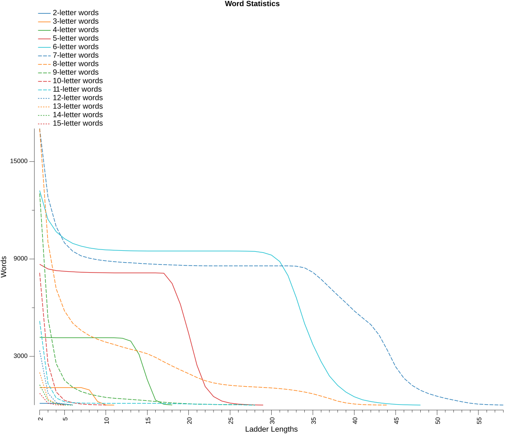
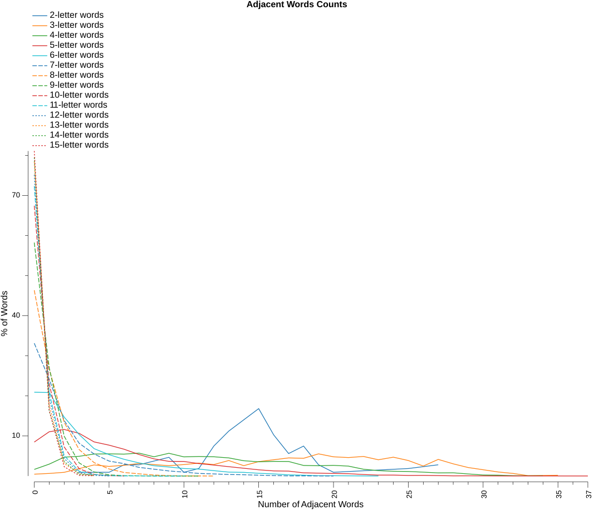

# Analysis Report

### Word Statistics

* Lexicon - based on NWL23
* Islands - are words that changing any letter will not form another word
* Doublets - are words that changing any letter will only form one other word
* LDS% (local decay smoothness) – the longest consecutive run of ladder lengths for which each word count is at least 95% of the previous ladder length’s count, expressed as a percentage of all ladder lengths in the dictionary
* Var – variance of consecutive count ratios, measuring how smoothly (low) or unevenly (high) word counts decay across ladder lengths
* Drop% – percentage decrease from ladder length 2 to 3, representing initial connectivity decay
* Longest - is the longest possible ladder length for the dictionary
* Numeric columns - are the number of words that can form that ladder length

| Letters | Words | Islands |   %  | Doublets |   %  | LDS% |  Var | Drop% | Longest |     2 |     3 |     4 |     5 |     6 |     7 |     8 |     9 |    10 |    11 |    12 |    13 |    14 |    15 |    16 |    17 |    18 |    19 |    20 |    21 |    22 |    23 |    24 |    25 |    26 |    27 |    28 |    29 |    30 |    31 |    32 |    33 |    34 |    35 |    36 |    37 |    38 |    39 |    40 |    41 |    42 |    43 |    44 |    45 |    46 |    47 |    48 |    49 |    50 |    51 |    52 |    53 |    54 |    55 |    56 |    57 |    58 |
|--------:|------:|--------:|-----:|---------:|-----:|-----:|-----:|------:|--------:|------:|------:|------:|------:|------:|------:|------:|------:|------:|------:|------:|------:|------:|------:|------:|------:|------:|------:|------:|------:|------:|------:|------:|------:|------:|------:|------:|------:|------:|------:|------:|------:|------:|------:|------:|------:|------:|------:|------:|------:|------:|------:|------:|------:|------:|------:|------:|------:|------:|------:|------:|------:|------:|------:|------:|------:|------:|
|       2 |   107 |       0 |  0.0 |        0 |  0.0 | 60.0 | 0.14 |   0.0 |       6 |   107 |   107 |   107 |    67 |     6 |       |       |       |       |       |       |       |       |       |       |       |       |       |       |       |       |       |       |       |       |       |       |       |       |       |       |       |       |       |       |       |       |       |       |       |       |       |       |       |       |       |       |       |       |       |       |       |       |       |       |       |       |
|       3 |  1085 |       5 |  0.5 |        0 |  0.0 | 60.0 | 0.15 |   0.0 |      11 |  1080 |  1080 |  1080 |  1080 |  1080 |  1080 |   933 |   218 |     7 |     2 |       |       |       |       |       |       |       |       |       |       |       |       |       |       |       |       |       |       |       |       |       |       |       |       |       |       |       |       |       |       |       |       |       |       |       |       |       |       |       |       |       |       |       |       |       |       |       |
|       4 |  4247 |      70 |  1.6 |       19 |  0.4 | 70.6 | 0.11 |   0.5 |      18 |  4177 |  4158 |  4150 |  4150 |  4150 |  4150 |  4150 |  4150 |  4150 |  4148 |  4117 |  3943 |  3127 |  1564 |   305 |    51 |     8 |       |       |       |       |       |       |       |       |       |       |       |       |       |       |       |       |       |       |       |       |       |       |       |       |       |       |       |       |       |       |       |       |       |       |       |       |       |       |       |       |
|       5 |  9476 |     803 |  8.5 |      288 |  3.0 | 57.1 | 0.06 |   3.3 |      29 |  8673 |  8385 |  8282 |  8240 |  8210 |  8181 |  8169 |  8159 |  8148 |  8142 |  8142 |  8142 |  8142 |  8142 |  8142 |  8120 |  7489 |  6206 |  4409 |  2460 |  1140 |   529 |   250 |   124 |    61 |    31 |    12 |     4 |       |       |       |       |       |       |       |       |       |       |       |       |       |       |       |       |       |       |       |       |       |       |       |       |       |       |       |       |       |
|       6 | 16706 |    3494 | 20.9 |     1774 | 10.6 | 59.6 | 0.04 |  13.4 |      48 | 13212 | 11438 | 10676 | 10248 |  9955 |  9790 |  9675 |  9601 |  9558 |  9537 |  9515 |  9501 |  9492 |  9487 |  9487 |  9487 |  9487 |  9487 |  9487 |  9487 |  9487 |  9487 |  9487 |  9487 |  9485 |  9480 |  9463 |  9393 |  9237 |  8841 |  7973 |  6616 |  5023 |  3734 |  2676 |  1793 |  1213 |   800 |   515 |   327 |   219 |   140 |    86 |    45 |    21 |    12 |     3 |       |       |       |       |       |       |       |       |       |       |
|       7 | 25473 |    8442 | 33.1 |     4204 | 16.5 | 52.6 | 0.03 |  24.7 |      58 | 17031 | 12827 | 10987 |  9988 |  9474 |  9192 |  9048 |  8948 |  8884 |  8833 |  8790 |  8764 |  8728 |  8697 |  8672 |  8650 |  8630 |  8612 |  8593 |  8582 |  8577 |  8574 |  8574 |  8574 |  8574 |  8574 |  8574 |  8574 |  8574 |  8574 |  8574 |  8553 |  8452 |  8177 |  7749 |  7255 |  6766 |  6296 |  5801 |  5374 |  4957 |  4317 |  3380 |  2361 |  1657 |  1212 |   911 |   702 |   548 |   418 |   309 |   205 |   118 |    60 |    34 |    15 |     5 |
|       8 | 31736 |   14716 | 46.4 |     6966 | 21.9 | 18.6 | 0.03 |  40.9 |      44 | 17020 | 10054 |  7159 |  5801 |  5042 |  4604 |  4283 |  4051 |  3878 |  3731 |  3575 |  3437 |  3314 |  3162 |  2938 |  2666 |  2408 |  2167 |  1936 |  1700 |  1504 |  1368 |  1279 |  1217 |  1177 |  1144 |  1117 |  1089 |  1058 |  1016 |   963 |   892 |   805 |   697 |   555 |   407 |   244 |   135 |    69 |    32 |    15 |     7 |     3 |       |       |       |       |       |       |       |       |       |       |       |       |       |       |
|       9 | 31229 |   18195 | 58.3 |     7673 | 24.6 |  0.0 | 0.02 |  58.9 |      28 | 13034 |  5361 |  2552 |  1526 |  1096 |   837 |   677 |   567 |   475 |   422 |   387 |   349 |   313 |   271 |   221 |   177 |   135 |   107 |    82 |    63 |    48 |    41 |    35 |    27 |    20 |    11 |     3 |       |       |       |       |       |       |       |       |       |       |       |       |       |       |       |       |       |       |       |       |       |       |       |       |       |       |       |       |       |       |
|      10 | 25028 |   16884 | 67.5 |     5568 | 22.2 |  0.0 | 0.01 |  68.4 |      10 |  8144 |  2576 |   809 |   291 |   144 |    68 |    35 |    17 |     6 |       |       |       |       |       |       |       |       |       |       |       |       |       |       |       |       |       |       |       |       |       |       |       |       |       |       |       |       |       |       |       |       |       |       |       |       |       |       |       |       |       |       |       |       |       |       |       |       |
|      11 | 18735 |   13557 | 72.4 |     3844 | 20.5 | 29.6 | 0.05 |  74.2 |      28 |  5178 |  1334 |   439 |   202 |   149 |   128 |   119 |   112 |   107 |   107 |   107 |   107 |   107 |   107 |   105 |    99 |    92 |    81 |    69 |    59 |    48 |    41 |    35 |    27 |    20 |    11 |     3 |       |       |       |       |       |       |       |       |       |       |       |       |       |       |       |       |       |       |       |       |       |       |       |       |       |       |       |       |       |       |
|      12 | 13515 |   10161 | 75.2 |     2611 | 19.3 |  0.0 | 0.00 |  77.8 |       5 |  3354 |   743 |   169 |    19 |       |       |       |       |       |       |       |       |       |       |       |       |       |       |       |       |       |       |       |       |       |       |       |       |       |       |       |       |       |       |       |       |       |       |       |       |       |       |       |       |       |       |       |       |       |       |       |       |       |       |       |       |       |
|      13 |  9323 |    7314 | 78.5 |     1636 | 17.5 |  0.0 | 0.00 |  81.4 |       5 |  2009 |   373 |    84 |     8 |       |       |       |       |       |       |       |       |       |       |       |       |       |       |       |       |       |       |       |       |       |       |       |       |       |       |       |       |       |       |       |       |       |       |       |       |       |       |       |       |       |       |       |       |       |       |       |       |       |       |       |       |       |
|      14 |  6102 |    4850 | 79.5 |      973 | 15.9 |  0.0 | 0.02 |  77.7 |       6 |  1252 |   279 |    77 |     6 |     3 |       |       |       |       |       |       |       |       |       |       |       |       |       |       |       |       |       |       |       |       |       |       |       |       |       |       |       |       |       |       |       |       |       |       |       |       |       |       |       |       |       |       |       |       |       |       |       |       |       |       |       |       |
|      15 |  3839 |    3114 | 81.1 |      604 | 15.7 |  0.0 | 0.00 |  83.3 |       5 |   725 |   121 |    14 |     2 |       |       |       |       |       |       |       |       |       |       |       |       |       |       |       |       |       |       |       |       |       |       |       |       |       |       |       |       |       |       |       |       |       |       |       |       |       |       |       |       |       |       |       |       |       |       |       |       |       |       |       |       |       |

Observation notes:
1. word - islands = ladder length 2 words
2. word - islands - doublets = ladder length 3 words

### Adjacent Words Counts

This table shows the spread of adjacent word counts for each word in the dictionary.
* Words are considered adjacent if changing just one letter in one word forms the other word.

| Letters |     0 |     1 |     2 |     3 |     4 |     5 |     6 |     7 |     8 |     9 |    10 |    11 |    12 |    13 |    14 |    15 |    16 |    17 |    18 |    19 |    20 |    21 |    22 |    23 |    24 |    25 |    26 |    27 |    28 |    29 |    30 |    31 |    32 |    33 |    34 |    35 |    36 |    37 |
|--------:|------:|------:|------:|------:|------:|------:|------:|------:|------:|------:|------:|------:|------:|------:|------:|------:|------:|------:|------:|------:|------:|------:|------:|------:|------:|------:|------:|------:|------:|------:|------:|------:|------:|------:|------:|------:|------:|------:|
|       2 |       |       |       |     1 |       |     1 |     3 |     3 |     4 |     5 |     1 |     2 |     8 |    12 |    15 |    18 |    11 |     6 |     8 |     3 |     1 |       |       |       |       |     2 |       |     3 |       |       |       |       |       |       |       |       |       |       |
|       3 |     5 |     7 |    10 |    20 |    30 |    26 |    29 |    34 |    31 |    28 |    31 |    35 |    31 |    42 |    28 |    39 |    44 |    49 |    48 |    60 |    52 |    50 |    53 |    44 |    51 |    42 |    27 |    45 |    33 |    23 |    17 |    11 |     7 |     1 |       |     2 |       |       |
|       4 |    70 |   126 |   200 |   209 |   233 |   235 |   232 |   243 |   204 |   241 |   203 |   207 |   204 |   192 |   162 |   151 |   155 |   154 |   112 |   109 |   113 |   105 |    72 |    57 |    50 |    48 |    41 |    33 |    34 |    22 |    11 |     9 |     4 |     3 |     3 |       |       |       |
|       5 |   803 |  1047 |  1101 |  1010 |   807 |   730 |   634 |   509 |   406 |   347 |   344 |   294 |   259 |   221 |   184 |   147 |   121 |   116 |    75 |    68 |    60 |    55 |    36 |    22 |    22 |    14 |    15 |    10 |     4 |     5 |     4 |     2 |     1 |     2 |       |       |       |     1 |
|       6 |  3494 |  3484 |  2456 |  1731 |  1141 |   890 |   697 |   547 |   429 |   375 |   313 |   289 |   224 |   163 |   153 |   114 |    88 |    49 |    35 |    13 |    12 |     8 |       |     1 |       |       |       |       |       |       |       |       |       |       |       |       |       |       |
|       7 |  8442 |  6149 |  3526 |  2084 |  1400 |   951 |   785 |   549 |   436 |   322 |   250 |   164 |   134 |    97 |    82 |    52 |    29 |    10 |    10 |       |     1 |       |       |       |       |       |       |       |       |       |       |       |       |       |       |       |       |       |
|       8 | 14716 |  8475 |  4254 |  2096 |  1061 |   559 |   280 |   175 |    77 |    31 |    11 |       |     1 |       |       |       |       |       |       |       |       |       |       |       |       |       |       |       |       |       |       |       |       |       |       |       |       |       |
|       9 | 18195 |  8443 |  3107 |  1022 |   316 |    92 |    29 |    17 |     5 |     1 |     1 |     1 |       |       |       |       |       |       |       |       |       |       |       |       |       |       |       |       |       |       |       |       |       |       |       |       |       |       |
|      10 | 16884 |  5745 |  1819 |   456 |   103 |    19 |     2 |       |       |       |       |       |       |       |       |       |       |       |       |       |       |       |       |       |       |       |       |       |       |       |       |       |       |       |       |       |       |       |
|      11 | 13557 |  3894 |   956 |   225 |    73 |    16 |     5 |     7 |     1 |       |     1 |       |       |       |       |       |       |       |       |       |       |       |       |       |       |       |       |       |       |       |       |       |       |       |       |       |       |       |
|      12 | 10161 |  2630 |   591 |   110 |    21 |     2 |       |       |       |       |       |       |       |       |       |       |       |       |       |       |       |       |       |       |       |       |       |       |       |       |       |       |       |       |       |       |       |       |
|      13 |  7314 |  1652 |   293 |    54 |    10 |       |       |       |       |       |       |       |       |       |       |       |       |       |       |       |       |       |       |       |       |       |       |       |       |       |       |       |       |       |       |       |       |       |
|      14 |  4850 |   990 |   222 |    26 |    14 |       |       |       |       |       |       |       |       |       |       |       |       |       |       |       |       |       |       |       |       |       |       |       |       |       |       |       |       |       |       |       |       |       |
|      15 |  3114 |   628 |    89 |     6 |     2 |       |       |       |       |       |       |       |       |       |       |       |       |       |       |       |       |       |       |       |       |       |       |       |       |       |       |       |       |       |       |       |       |       |

### Longest Ladders

#### 2-letter words

* _**6**_ words at maximum ladder length _**6**_
* `ID`, `IF`, `IN`, `IS`, `IT`, `JO`

#### 3-letter words

* _**2**_ words at maximum ladder length _**11**_
* `IVY`, `ZZZ`

#### 4-letter words

* _**8**_ words at maximum ladder length _**18**_
* `ATAP`, `ATOM`, `INCH`, `OXID`, `OXIM`, `QUEY`, `UNAU`, `YEOW`

#### 5-letter words

* _**4**_ words at maximum ladder length _**29**_
* `APTLY`, `ASCUS`, `GENRO`, `ILLER`

#### 6-letter words

* _**3**_ words at maximum ladder length _**48**_
* `BASSLY`, `BROOCH`, `WREATH`

#### 7-letter words

* _**5**_ words at maximum ladder length _**58**_
* `DEFUZED`, `ENROBER`, `ENROBES`, `UNHOPED`, `UNROPES`

#### 8-letter words

* _**3**_ words at maximum ladder length _**44**_
* `COURSING`, `HOPPLING`, `POPPLING`

#### 9-letter words

* _**3**_ words at maximum ladder length _**28**_
* `DODGINESS`, `NERVINESS`, `PODGINESS`

#### 10-letter words

* _**6**_ words at maximum ladder length _**10**_
* `BLISTERING`, `GLISTENING`, `SCUTTERING`, `SPUTTERING`, `STUTTERING`, `SWITHERING`

#### 11-letter words

* _**3**_ words at maximum ladder length _**28**_
* `DODGINESSES`, `NERVINESSES`, `PODGINESSES`

#### 12-letter words

* _**19**_ words at maximum ladder length _**5**_
* `BASIFICATION`, `CROAKINESSES`, `DREARINESSES`, `FLOPPINESSES`, `FREAKINESSES`, `NATIONALISMS`, `NATIONALISTS`, `NATIONALIZED`, `NATIONALIZER`, `NOSOGRAPHIES`, `PHAGOCYTIZED`, `PHAGOCYTOSIS`, `RATIFICATION`, `RATIONALISMS`, `RATIONALISTS`, `RATIONALIZED`, `RATIONALIZER`, `SNAPPINESSES`, `TYPOGRAPHIES`

#### 13-letter words

* _**8**_ words at maximum ladder length _**5**_
* `BASIFICATIONS`, `DECENTRALISTS`, `DEVOLUTIONISM`, `EXPANDABILITY`, `EXTENSIBILITY`, `RATIFICATIONS`, `RECENTRALIZED`, `REVOLUTIONIZE`

#### 14-letter words

* _**3**_ words at maximum ladder length _**6**_
* `DEVOLUTIONISMS`, `REVOLUTIONIZED`, `REVOLUTIONIZER`

#### 15-letter words

* _**2**_ words at maximum ladder length _**5**_
* `EXPANDABILITIES`, `EXTENSIBILITIES`

